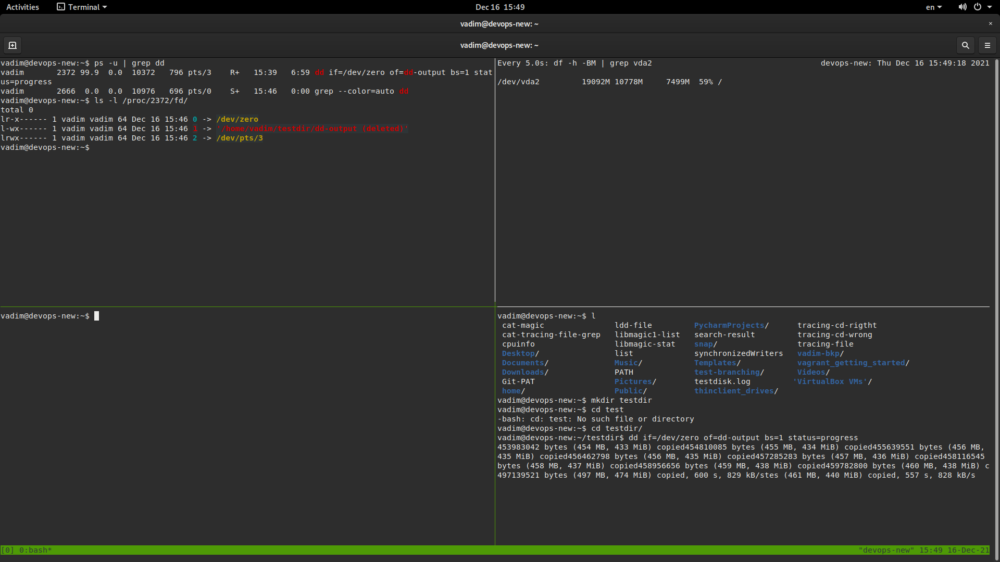
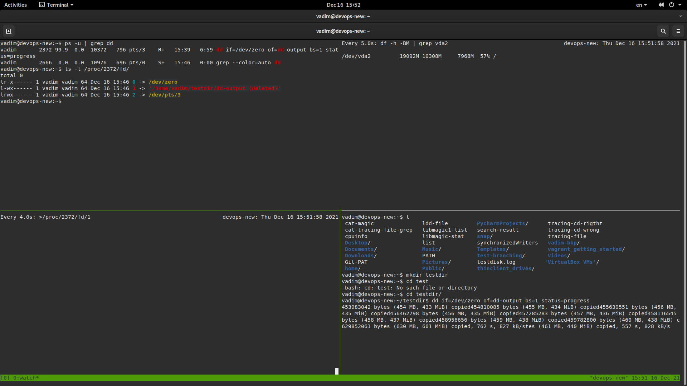

Домашнее задание к занятию «3.3. Операционные системы, лекция 1"
----------------------------------------------------------
----------------------------------------------------------  
  
1. Любой системный вызов вернет по результатам своей работы код возврата. Читая man syscalls, можем  
   увидеть среди системных вызовов chdir. Также мы можем видеть из описания, что обычно системные вызовы не  
   вызываются напрямую, а через так называемые wrapper fuctions в библиотеке glibc ( либо другой библиотеке ).  
   Эти функции зачастую только передают аргументы системным вызовам, путем их копирования в регистры памяти  
   и забирают от системных вызовов код завершения для передачи в вызвавшую их команду ( пользователю ).  
   Также для и для chdir существует подобная обертка - ( wrapper ) функция chdir.  
   Вызвав man 2 chdir видим, что при возращении реультатов своей работы syscall chdir вернет EACCES, если  
   была попытка доступа при просмотре к файлам без необходимых прав ( например - в каталог другого пользователя ).
   Используем это и выполним последовательно две команды strace на bash с командами смены каталогов на /tmp,  
   затем - на /root:  
```bash
vadim@devops-new:~$ strace -o tracing-cd-rigtht /bin/bash -c 'cd /tmp'
```  
фрагмент вывода из файла tracing-cd-rigtht:
```bash
...
getpgrp()                               = 1979
ioctl(2, TIOCGPGRP, [1979])             = 0
rt_sigaction(SIGCHLD, {sa_handler=0x5651a7dc0aa0, sa_mask=[], sa_flags=SA_RESTORER|SA_RESTART, sa_restorer=0x7f8ab51f4210}, {sa_handler=SIG_DFL, sa_mask=[], sa_flags=SA_RESTORER|SA_RESTART, sa_restorer=0x7f8ab51f4210}, 8) = 0
prlimit64(0, RLIMIT_NPROC, NULL, {rlim_cur=31622, rlim_max=31622}) = 0
rt_sigprocmask(SIG_BLOCK, NULL, [], 8)  = 0
rt_sigprocmask(SIG_BLOCK, NULL, [], 8)  = 0
stat("/tmp", {st_mode=S_IFDIR|S_ISVTX|0777, st_size=4096, ...}) = 0
chdir("/tmp")                           = 0
rt_sigprocmask(SIG_BLOCK, [CHLD], [], 8) = 0
rt_sigprocmask(SIG_SETMASK, [], NULL, 8) = 0
exit_group(0)                           = ?
+++ exited with 0 +++
```  
```bash  
vadim@devops-new:~$ strace -o tracing-cd-wrong /bin/bash -c 'cd /root'
/bin/bash: line 0: cd: /root: Permission denied
```  
фрагмент вывода из файла tracing-cd-wrong:  
```bash  
...
ioctl(2, TIOCGPGRP, [2502])             = 0
rt_sigaction(SIGCHLD, {sa_handler=0x5565d7db7aa0, sa_mask=[], sa_flags=SA_RESTORER|SA_RESTART, sa_restorer=0x7f09ae309210}, {sa_handler=SIG_DFL, sa_mask=[], sa_flags=SA_RESTORER|SA_RESTART, sa_restorer=0x7f09ae309210}, 8) = 0
prlimit64(0, RLIMIT_NPROC, NULL, {rlim_cur=31622, rlim_max=31622}) = 0
rt_sigprocmask(SIG_BLOCK, NULL, [], 8)  = 0
stat("/root", {st_mode=S_IFDIR|0700, st_size=4096, ...}) = 0
chdir("/root")                          = -1 EACCES (Permission denied)
chdir("/root")                          = -1 EACCES (Permission denied)
openat(AT_FDCWD, "/usr/share/locale/C.UTF-8/LC_MESSAGES/libc.mo", O_RDONLY) = -1 ENOENT (No such file or directory)
openat(AT_FDCWD, "/usr/share/locale/C.utf8/LC_MESSAGES/libc.mo", O_RDONLY) = -1 ENOENT (No such file or directory)
openat(AT_FDCWD, "/usr/share/locale/C/LC_MESSAGES/libc.mo", O_RDONLY) = -1 ENOENT (No such file or directory)
openat(AT_FDCWD, "/usr/share/locale-langpack/C/LC_MESSAGES/bash.mo", O_RDONLY) = -1 ENOENT (No such file or directory)
...
write(2, "/bin/bash: line 0: cd: /root: Pe"..., 48) = 48
rt_sigprocmask(SIG_BLOCK, [CHLD], [], 8) = 0
rt_sigprocmask(SIG_SETMASK, [], NULL, 8) = 0
exit_group(1)                           = ?
+++ exited with 1 +++
```  
Системный вызов, вернувший ошибку EACCES из второй команды - и есть наш единственный.  
Он же вернул код ошибки 0 из первой команды. Этот вызов - chdir.  
  
2. Задачу я начал решать, применив сразу strace команды file. Но опцию команды задал в виде простого каталога, чтобы  
   упростить поиск решения:
```bash  
strace -o tracing-file /bin/bash -c 'file vadim-bkp'
```  
,здесь вывели результат трассировки `file vadim-bkp` в файл tracing-file.  
```bash  
vadim@devops-new:~$ vim tracing-file

execve("/bin/bash", ["/bin/bash", "-c", "file vadim-bkp"], 0x7ffe975c4530 /* 35 vars */) = 0
brk(NULL)                               = 0x55ca552ba000
arch_prctl(0x3001 /* ARCH_??? */, 0x7fffedba1a80) = -1 EINVAL (Invalid argument)
access("/etc/ld.so.preload", R_OK)      = -1 ENOENT (No such file or directory)
openat(AT_FDCWD, "/etc/ld.so.cache", O_RDONLY|O_CLOEXEC) = 3
fstat(3, {st_mode=S_IFREG|0644, st_size=72002, ...}) = 0
mmap(NULL, 72002, PROT_READ, MAP_PRIVATE, 3, 0) = 0x7fa524744000
close(3)                                = 0
openat(AT_FDCWD, "/lib/x86_64-linux-gnu/libtinfo.so.6", O_RDONLY|O_CLOEXEC) = 3
read(3, "\177ELF\2\1\1\0\0\0\0\0\0\0\0\0\3\0>\0\1\0\0\0\240\346\0\0\0\0\0\0"..., 832) = 832
fstat(3, {st_mode=S_IFREG|0644, st_size=192032, ...}) = 0
mmap(NULL, 8192, PROT_READ|PROT_WRITE, MAP_PRIVATE|MAP_ANONYMOUS, -1, 0) = 0x7fa524742000
close(3)                                = 0
...
openat(AT_FDCWD, "/lib/x86_64-linux-gnu/libdl.so.2", O_RDONLY|O_CLOEXEC) = 3
...
openat(AT_FDCWD, "/lib/x86_64-linux-gnu/libc.so.6", O_RDONLY|O_CLOEXEC) = 3
...
openat(AT_FDCWD, "/dev/tty", O_RDWR|O_NONBLOCK) = 3
...
openat(AT_FDCWD, "/usr/lib/locale/locale-archive", O_RDONLY|O_CLOEXEC) = 3
...
openat(AT_FDCWD, "/usr/share/locale/locale.alias", O_RDONLY|O_CLOEXEC) = 3
...
openat(AT_FDCWD, "/usr/lib/locale/C.UTF-8/LC_IDENTIFICATION", O_RDONLY|O_CLOEXEC) = 3
...
openat(AT_FDCWD, "/usr/lib/x86_64-linux-gnu/gconv/gconv-modules.cache", O_RDONLY) = 3
...
openat(AT_FDCWD, "/usr/lib/locale/C.UTF-8/LC_MEASUREMENT", O_RDONLY|O_CLOEXEC) = 3
...
openat(AT_FDCWD, "/usr/lib/locale/C.UTF-8/LC_TELEPHONE", O_RDONLY|O_CLOEXEC) = 3
...
openat(AT_FDCWD, "/usr/lib/locale/C.UTF-8/LC_ADDRESS", O_RDONLY|O_CLOEXEC) = 3
...
openat(AT_FDCWD, "/usr/lib/locale/C.UTF-8/LC_NAME", O_RDONLY|O_CLOEXEC) = 3
...
openat(AT_FDCWD, "/usr/lib/locale/C.UTF-8/LC_PAPER", O_RDONLY|O_CLOEXEC) = 3
...
openat(AT_FDCWD, "/usr/lib/locale/C.UTF-8/LC_MESSAGES", O_RDONLY|O_CLOEXEC) = 3
...
openat(AT_FDCWD, "/usr/lib/locale/C.UTF-8/LC_MESSAGES/SYS_LC_MESSAGES", O_RDONLY|O_CLOEXEC) = 3
...
openat(AT_FDCWD, "/usr/lib/locale/C.UTF-8/LC_MONETARY", O_RDONLY|O_CLOEXEC) = 3
...
openat(AT_FDCWD, "/usr/lib/locale/C.UTF-8/LC_COLLATE", O_RDONLY|O_CLOEXEC) = 3
...
openat(AT_FDCWD, "/usr/lib/locale/C.UTF-8/LC_TIME", O_RDONLY|O_CLOEXEC) = 3
...
openat(AT_FDCWD, "/usr/lib/locale/C.UTF-8/LC_NUMERIC", O_RDONLY|O_CLOEXEC) = 3
...
stat("/usr/local/sbin/file", 0x7fffedba1430) = -1 ENOENT (No such file or directory)
stat("/usr/local/bin/file", 0x7fffedba1430) = -1 ENOENT (No such file or directory)
stat("/usr/sbin/file", 0x7fffedba1430)  = -1 ENOENT (No such file or directory)
stat("/usr/bin/file", {st_mode=S_IFREG|0755, st_size=27104, ...}) = 0
stat("/usr/bin/file", {st_mode=S_IFREG|0755, st_size=27104, ...}) = 0
geteuid()                               = 1000
getegid()                               = 1001
getuid()                                = 1000
getgid()                                = 1001
access("/usr/bin/file", X_OK)           = 0
stat("/usr/bin/file", {st_mode=S_IFREG|0755, st_size=27104, ...}) = 0
geteuid()                               = 1000
getegid()                               = 1001
getuid()                                = 1000
getgid()                                = 1001
access("/usr/bin/file", R_OK)           = 0
stat("/usr/bin/file", {st_mode=S_IFREG|0755, st_size=27104, ...}) = 0
stat("/usr/bin/file", {st_mode=S_IFREG|0755, st_size=27104, ...}) = 0
geteuid()                               = 1000
getegid()                               = 1001
getuid()                                = 1000
getgid()                                = 1001
access("/usr/bin/file", X_OK)           = 0
stat("/usr/bin/file", {st_mode=S_IFREG|0755, st_size=27104, ...}) = 0
geteuid()                               = 1000
getegid()                               = 1001
getuid()                                = 1000
getgid()                                = 1001
access("/usr/bin/file", R_OK)           = 0
...
execve("/usr/bin/file", ["file", "vadim-bkp"], 0x55ca552c7d80 /* 35 vars */) = 0
brk(NULL)                               = 0x5594ec0a3000
arch_prctl(0x3001 /* ARCH_??? */, 0x7ffc96e58a30) = -1 EINVAL (Invalid argument)
access("/etc/ld.so.preload", R_OK)      = -1 ENOENT (No such file or directory)
openat(AT_FDCWD, "/etc/ld.so.cache", O_RDONLY|O_CLOEXEC) = 3
...
openat(AT_FDCWD, "/lib/x86_64-linux-gnu/libmagic.so.1", O_RDONLY|O_CLOEXEC) = 3
...
openat(AT_FDCWD, "/lib/x86_64-linux-gnu/libc.so.6", O_RDONLY|O_CLOEXEC) = 3
...
openat(AT_FDCWD, "/lib/x86_64-linux-gnu/liblzma.so.5", O_RDONLY|O_CLOEXEC) = 3
...
openat(AT_FDCWD, "/lib/x86_64-linux-gnu/libbz2.so.1.0", O_RDONLY|O_CLOEXEC) = 3
...
openat(AT_FDCWD, "/lib/x86_64-linux-gnu/libz.so.1", O_RDONLY|O_CLOEXEC) = 3
...
openat(AT_FDCWD, "/lib/x86_64-linux-gnu/libpthread.so.0", O_RDONLY|O_CLOEXEC) = 3
brk(0x5594ec0c4000)                     = 0x5594ec0c4000
openat(AT_FDCWD, "/usr/lib/locale/locale-archive", O_RDONLY|O_CLOEXEC) = 3
fstat(3, {st_mode=S_IFREG|0644, st_size=5699248, ...}) = 0
mmap(NULL, 5699248, PROT_READ, MAP_PRIVATE, 3, 0) = 0x7f1c5eab1000
close(3)                                = 0
openat(AT_FDCWD, "/usr/share/locale/locale.alias", O_RDONLY|O_CLOEXEC) = 3
fstat(3, {st_mode=S_IFREG|0644, st_size=2996, ...}) = 0
read(3, "# Locale name alias data base.\n#"..., 4096) = 2996
read(3, "", 4096)                       = 0
close(3)                                = 0
openat(AT_FDCWD, "/usr/lib/locale/C.UTF-8/LC_CTYPE", O_RDONLY|O_CLOEXEC) = 3
fstat(3, {st_mode=S_IFREG|0644, st_size=201272, ...}) = 0
mmap(NULL, 201272, PROT_READ, MAP_PRIVATE, 3, 0) = 0x7f1c5ea7f000
close(3)                                = 0
openat(AT_FDCWD, "/usr/lib/x86_64-linux-gnu/gconv/gconv-modules.cache", O_RDONLY) = 3
fstat(3, {st_mode=S_IFREG|0644, st_size=27002, ...}) = 0
mmap(NULL, 27002, PROT_READ, MAP_SHARED, 3, 0) = 0x7f1c5f2c8000
close(3)                                = 0
futex(0x7f1c5f28e634, FUTEX_WAKE_PRIVATE, 2147483647) = 0
stat("/home/vadim/.magic.mgc", 0x7ffc96e58790) = -1 ENOENT (No such file or directory)
stat("/home/vadim/.magic", 0x7ffc96e58790) = -1 ENOENT (No such file or directory)
openat(AT_FDCWD, "/etc/magic.mgc", O_RDONLY) = -1 ENOENT (No such file or directory)
stat("/etc/magic", {st_mode=S_IFREG|0644, st_size=111, ...}) = 0
openat(AT_FDCWD, "/etc/magic", O_RDONLY) = 3
fstat(3, {st_mode=S_IFREG|0644, st_size=111, ...}) = 0
read(3, "# Magic local data for file(1) c"..., 4096) = 111
read(3, "", 4096)                       = 0
close(3)                                = 0
openat(AT_FDCWD, "/usr/share/misc/magic.mgc", O_RDONLY) = 3
fstat(3, {st_mode=S_IFREG|0644, st_size=5811536, ...}) = 0
mmap(NULL, 5811536, PROT_READ|PROT_WRITE, MAP_PRIVATE, 3, 0) = 0x7f1c5e4f4000
close(3)                                = 0
mprotect(0x7f1c5e4f4000, 5811536, PROT_READ) = 0
fstat(1, {st_mode=S_IFCHR|0620, st_rdev=makedev(0x88, 0x1), ...}) = 0
mmap(NULL, 1052672, PROT_READ|PROT_WRITE, MAP_PRIVATE|MAP_ANONYMOUS, -1, 0) = 0x7f1c5e3f3000
lstat("vadim-bkp", {st_mode=S_IFDIR|0755, st_size=4096, ...}) = 0
munmap(0x7f1c5e3f3000, 1052672)         = 0
write(1, "vadim-bkp: directory\n", 21)  = 21
munmap(0x7f1c5e4f4000, 5811536)         = 0
exit_group(0)                           = ?
+++ exited with 0 +++  
```  
В моей системе вывод занял более 300 строк, поэтому я сократил его здесь, оставив наиболее показательные.  
Почему я пошел именно таким путем? В любом случае системные вызовы пришлось бы изучить, это во-первых. Сделав  
несколько предварительных вызовов strace с другими аргументами, я только убедился в своем решении начать изучать их прямо по ходу анализа трассировки из вышеприведенного листинга. Ведь все равно они используются многократно.  
Итак, мы видим, что последовательно применяются ( описание вызовов сокращено и приведено мной для понимания смысла их работы ): 
execve с параметрами - выполнить программу ..   
bkr (NULL) - .. установить значение адреса для конца сегмента данных, изменить место program break в памяти  
access - проверить права доступа пользователя к файлу, наличие файла ..  
openat - открыть файл и назначить ему fd ( параметры открытия задаются в виде аргументов в скобках функции openat )..  
fstat - статус файла по его fd
mmap - создает новое сопоставление в виртуальном адресном пространстве вызывающего процесса, при дословном перевода ман-страницы. Как я понимаю речь идет о том, что вызов создает/размечает карту адресов, с начальным адресом и длиной, которые заданы в аргументах. Аргументом же является и fd. Судя по тому, что файл с fd=3, открытый предыдушим вызовом openat, является динамическим компоновщиком/загрузчким ( man ld.so ) mmap обеспечивает ему ресурс памяти для работы.  
Если посмотреть далее по вызовам, то становиться ясно, что мы наблюдаем как системные вызовы используются для чтения/модификации файлов,  
верификации их наличии и прав доступа к ним, выделения ресурсов для работы вызываемых библиотек и программ ( каких - см. чуть ниже ).  
Уже на основании этого, проанализировав что за файлы "дергает" вызов openat, я обнаружил, что помимо разных служебных библиотек  
он обращается к libmagic.so.1. Ну вот, теплее! 
Посл анализа вывода strace, посмотрим:  
```bash  
vadim@devops-new:~$ ldd $(which file)A
	linux-vdso.so.1 (0x00007ffc2c9ee000)
	libmagic.so.1 => /lib/x86_64-linux-gnu/libmagic.so.1 (0x00007f267bc8f000)
	libc.so.6 => /lib/x86_64-linux-gnu/libc.so.6 (0x00007f267ba9d000)
	liblzma.so.5 => /lib/x86_64-linux-gnu/liblzma.so.5 (0x00007f267ba74000)
	libbz2.so.1.0 => /lib/x86_64-linux-gnu/libbz2.so.1.0 (0x00007f267ba61000)
	libz.so.1 => /lib/x86_64-linux-gnu/libz.so.1 (0x00007f267ba45000)
	/lib64/ld-linux-x86-64.so.2 (0x00007f267bcd3000)
	libpthread.so.0 => /lib/x86_64-linux-gnu/libpthread.so.0 (0x00007f267ba22000)
```  
Пойдем по порядку:  
linux-vdso.so.1 ( man 7 vdso) - небольшая разделяемая библиотека, размещается ядром автоматически в адресном прост-ве всех пользовательских  
приложений. vDSO обычнов вызывается библиотекой С.  
libmagic.so.1 - команда `dpkg -S libmagic.so.1` найдет файлы, владеющие пакетом:  
```bash  
libmagic1:amd64: /usr/lib/x86_64-linux-gnu/libmagic.so.1
libmagic1:amd64: /usr/lib/x86_64-linux-gnu/libmagic.so.1.0.0
```  
и мы видим, что пакет libmagic1 относится к нашему файлу. Тогда посмотрим статус пакета:  
```bash  
vadim@devops-new:~$ dpkg -s libmagic1
Package: libmagic1
Status: install ok installed
Priority: important
Section: libs
Installed-Size: 220
Maintainer: Ubuntu Developers <ubuntu-devel-discuss@lists.ubuntu.com>
Architecture: amd64
Multi-Arch: same
Source: file
Version: 1:5.38-4
Depends: libbz2-1.0, libc6 (>= 2.15), liblzma5 (>= 5.1.1alpha+20120614), zlib1g (>= 1:1.1.4), libmagic-mgc (= 1:5.38-4)
Suggests: file
Conffiles:
 /etc/magic 272913026300e7ae9b5e2d51f138e674
 /etc/magic.mime 272913026300e7ae9b5e2d51f138e674
Description: Recognize the type of data in a file using "magic" numbers - library
 This library can be used to classify files according to magic number
 tests. It implements the core functionality of the file command.
Original-Maintainer: Christoph Biedl <debian.axhn@manchmal.in-ulm.de>
Homepage: https://www.darwinsys.com/file/
```  
Судя по описанию, это то, что мы ищем. Но мы ведь еще на нашли базу. Тогда посмотрим список файлов, принадлежащих пакету:  
```bash  
vadim@devops-new:~$ dpkg -L libmagic1
/.
/etc
/etc/magic
/etc/magic.mime
/usr
/usr/lib
/usr/lib/x86_64-linux-gnu
/usr/lib/x86_64-linux-gnu/libmagic.so.1.0.0
/usr/share
/usr/share/bug
/usr/share/bug/libmagic1
/usr/share/bug/libmagic1/control
/usr/share/bug/libmagic1/presubj
/usr/share/doc
/usr/share/doc/libmagic1
/usr/share/doc/libmagic1/copyright
/usr/share/man
/usr/share/man/man5
/usr/share/man/man5/magic.5.gz
/usr/share/misc
/usr/lib/x86_64-linux-gnu/libmagic.so.1
/usr/share/doc/libmagic1/changelog.Debian.gz
/usr/share/misc/magic
```
далее man 5 magic, man 1 file подскажут нам, где искать базу данных, что и делает file как видно из листинга:  
```bash  
vadim@devops-new:~$ cat tracing-file | grep magic
openat(AT_FDCWD, "/lib/x86_64-linux-gnu/libmagic.so.1", O_RDONLY|O_CLOEXEC) = 3
stat("/home/vadim/.magic.mgc", 0x7ffc96e58790) = -1 ENOENT (No such file or directory)
stat("/home/vadim/.magic", 0x7ffc96e58790) = -1 ENOENT (No such file or directory)
openat(AT_FDCWD, "/etc/magic.mgc", O_RDONLY) = -1 ENOENT (No such file or directory)
stat("/etc/magic", {st_mode=S_IFREG|0644, st_size=111, ...}) = 0
openat(AT_FDCWD, "/etc/magic", O_RDONLY) = 3
openat(AT_FDCWD, "/usr/share/misc/magic.mgc", O_RDONLY) = 3
```  
Далее, используя поочередно команды file -L и cat для тех файлов, у которых stat(..) = 0 или openat(..) != -1:  
```bash  
vadim@devops-new:~$ file -L /etc/magic
/etc/magic: magic text file for file(1) cmd, ASCII text
vadim@devops-new:~$ cat /etc/magic
# Magic local data for file(1) command.
# Insert here your local magic data. Format is described in magic(5).

```  
здесь пользователь может добавить опциональные сигнатуры для поиска текстовых файлов.  
```bash  
vadim@devops-new:~$ file -L /usr/share/misc/magic.mgc
/usr/share/misc/magic.mgc: magic binary file for file(1) cmd (version 14) (little endian)
```  
при открытии этого файла cat'ом - на выводе абракадабра ( ожидаемо, т.к. файл бинарный ), которая перемежается с  
сигнатурами. Это и есть БД программы file.
Применяя man, dpkg можно узнать, что это за остальные используемые командой file, зависимости:  
libc.so.6 - библиотека С, содержит стандартные библиотеки, используемые всеми программами в системе
liblzma.so.5 - пакет программы vagrant (!)
libbz2.so.1.0 - библиотека нужна для работы со сжатыми файлами  
libz.so.1 - также библиотека для работы со сжатыми файлами  
/lib64/ld-linux-x86-64.so.2 - стандартная разделяемая библиотека С
libpthread.so.0 - также стандартная библиотека С  
  
3. Используем команду dd для иллюстрации выполнения задачи. Для удобства задача выполнена в tmux, разделенном на 4 окна.  
   В окне 4 ( номера окон указаны, как мне удобно было, могут быть произвольные ) выполним: `mkdir testdir && cd testdir`  
   , а затем `dd if=/dev/zero of=dd-output bs=1 status=progress`, начав таким образом запись в файл ~/testdir/dd-output.  
   после чего из окна например 3 выполним `cd tesdir && rm dd-output`.
   в окне 1 выполним `ps -u | grep dd' ,возьмем PID dd и с помощью `ls -l /proc/PID/fd` увидим, что dd-output удвлен
   в окне 3 выполним: `watch -n 5 'df -h -BM - | grep vda2'` ( здесь используем периодический запуск команды df, фильтруя  
   при помощи grep вывод для каталога /dev/vda2, т.к. на моей ВМ Ubuntu 20.04 все дерево каталогов системы установлено  
   в нем ). Выполнение данной конструкции дает периодическую инфо о свободном прострастве внутри /dev/vda2.  
   Видим, что постепенно места остается все меньше ( процесс dd продолжает запись на диск ):

     

   В окне 2 запустим команду-обнулитель `watch -n 4 '/proc/PID/fd/1' ( PID - получен командой ps -u ранее ): 

     
  
   Параметра -n команды watch можно увеличить, чтобы меньше загружать ЦП.  
    
5.  Зомби-процессы занимают только записи в таблице процессов, так как их PCB (program control block) системой не удаляются. 
    Ведь процессы не завершены и ожидают от родителей считывания их кодов завершения. 
    Однако в Linux есть ограничение на размер таблицы для каждого пользователя и системы в целом.  
   
6. 
