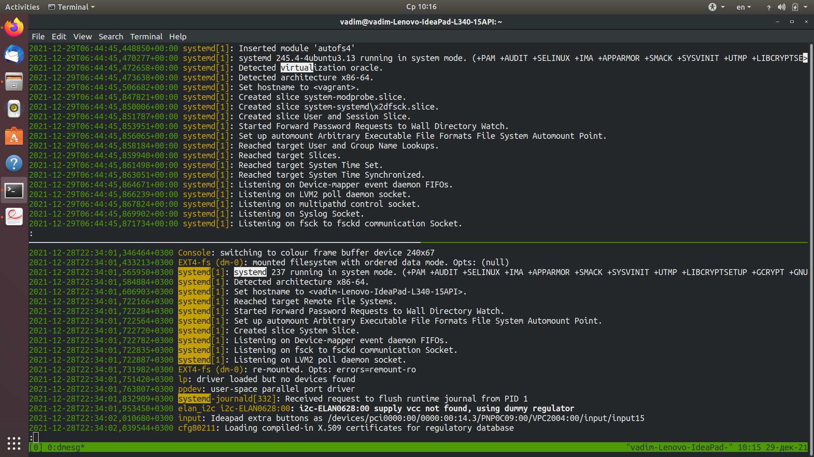

Домашнее задание к занятию «3.4. Операционные системы, лекция 2"
----------------------------------------------------------
----------------------------------------------------------  
 
1. После ознакомления с systemd, принято решение следовать рекомендации сохранять пользовательские файлы модулей ( unit files )
   в /etc/systemd/system. Для размещения планируемого к использованию бинарного файла node_exporter выбран каталог /usr/sbin.  
   Unit-файл для управления node_exporter:  
```bash
vagrant@vagrant:~$ vim /etc/systemd/system/node_exporter.service
[Unit]
Description=node metrics exporter
After=network.target

[Service]
ExecStart=/usr/sbin/node_exporter
Type=exec

[Install]
WantedBy=multi-user.target
```
Процесс контролируется и работает корректно: после перезагрузки/включения ВМ поднимается, а также через systemctl start/stop/restart/status 
запускается, останавливается, перезапускается ( PID процесса меняется при restart'e ), отображается:  
  
  
За автозапуск при загрузке системы отвечает параметр `WantedBy=multi-user.target` секции [Install]
Для добавления опций к запускаемому процессу через внешний файл можно использовать схему, при которой в среду окружения процесса (Environment)
добавляются переменные при помощи определения `EnvironmentFile=` в сеции [Service]. Именно так это реализовано при управлении cron'ом.
Также опробована возможность выполнить это путем создания файла `/etc/systemd/system/node_exporter.d/override.conf` с переопределением параметра
`ExecStart=/usr/sbin/node_exporter`, путем добавления к нему требуемой опции. Но в задании предложено взять за основу схему добавления опций в 
cron, при помощи определения `EnvironmentFile=`, тем более, что она имеет более высокий приоритет перед переопредением параметров юнитов 
при помощи `sysmetctl edit unit`. 

Реультат ( после применения опции для смены порта метрик с 9100 на 9200 ):  


  
2. Несколько опций, выбранных мной из метрик node_exporter для базового мониторинга хоста по:
```bash
CPU:
node_cpu_guest_seconds_total Seconds the CPUs spent in guests (VMs) for each mode
node_cpu_seconds_total Seconds the CPUs spent in each mode
node_pressure_cpu_waiting_seconds_total Total time in seconds that processes have waited for CPU time
node_schedstat_running_seconds_total Number of seconds CPU spent running a process
node_schedstat_waiting_seconds_total Number of seconds spent by processing waiting for this CPU
node_softnet_dropped_total Number of dropped packets
node_softnet_processed_total Number of processed packets
node_cpu_info CPU information from /proc/cpuinfo ( путем добавления опции --collector.cpu.info )

Памяти:
node_memory_MemAvailable_bytes Memory information field MemAvailable_bytes
node_memory_MemFree_bytes Memory information field MemFree_bytes
node_memory_MemTotal_bytes Memory information field MemTotal_bytes
node_memory_Mlocked_bytes Memory information field Mlocked_bytes
node_memory_PageTables_bytes Memory information field PageTables_bytes
ode_memory_SwapTotal_bytes Memory information field SwapTotal_bytes
  
Диску:  
node_filesystem_avail_bytes Filesystem space available to non-root users in bytes
node_filesystem_device_error Whether an error occurred while getting statistics for the given device
ode_filesystem_free_bytes Filesystem free space in bytes
ode_filesystem_size_bytes Filesystem size in bytes
  
Сети:
node_network_address_assign_type address_assign_type value of /sys/class/net/<iface>
node_network_mtu_bytes mtu_bytes value of /sys/class/net/<iface>
node_network_receive_bytes_total Network device statistic receive_bytes
node_network_receive_drop_total Network device statistic receive_drop
node_network_receive_errs_total Network device statistic receive_errs
node_network_transmit_bytes_total Network device statistic transmit_bytes
node_network_transmit_drop_total Network device statistic transmit_drop
node_network_transmit_errs_total Network device statistic transmit_errs
```
  
3. Правка конфигурации веб-сервера демона netdata:
   
  
Проброс порта в ВМ:

  
Результат ( netdata default metrics ):

  
4. Да, судя по приведенным ниже скринам, в которых приведен сравнительный анализ вывода dmesg в гостевой ОС и хостовой ОС 
( хронология сообщений при загрузке сохранена ):
 
Booting kernel on KVM vs bare hardware:
  

  
MTRR all blank vs MTRR fixed range enabled ( Memory-Type Range Registers (MTRR) can control caching behaviour with respect to memory writes ):


  
PMU not available vs using PMU driver ( PMU - perfomance monitoring unit, в данной ВМ недоступен, т.к. нет драйвера ):
  

  
virtualization detected by systemd vs systemd running in system mode:
  

  
5. `sysctl fs.nr_open` либо `cat /proc/sys/fs` дают и в ВМ Ubuntu 20.04 и в хост системе Ubuntu 18.04 одно и то же: 1048576.
This denotes the maximum number of file-handles a process can allocate / 
Это обозначает максимальное количество дескрипторов файлов, которые может выделить процесс.
В хостовой машине:
man 3 ulimit - предупреждает, что одноименная процедура, включаемая как заголовочный файл ulimit.h устарела и отсылает к вариантам:
shell command ulimit(), see bash(1) - обе команды естественно присуствуют в хостовой/гостевой ОС и для
`ulimit -n` - The maximum number of open file descriptors (most systems do not allow this value to be set) / Максимальное количество открытых файловых дескрипторов (большинство систем не позволяют устанавливать это значение) - значение равно 1024 ( все, что принимает/выводит ulimit умножается на множитель в 1024 байт, кроме отдельных аргументов, таких например как время (сек), 512-байтовые блоки для опции -p, 512-байтовые множители для опций -c, -f, либо безразмерные величины для  -P, -T, -b, -k, -n, and -u. Таким образом 1024 * 1024 = 1048576.
системный вызов setrlimit c аргументом RLIMIT_NOFILE, который на единицу превосходит максимальное количество файловых дескрипторов, которые может открыть процесс:
необходимо для использования этой возможности написать небольшую программу на С, включающую заголовочный файл sys/resource.h, но в задание это не входит.
  
6. Решение:  
Запуск сессии под root'ом

Запуск screen

Создание изолированного неймспейса и запуск sleep 1h внутри него

Detouch окна screen и просмотр процесса sleep 1h из хостового неймспейса

Демонстрация доступа в созданный неймспейс с хоста и вывод PID 1 процесса sleep 1h

  

7. :(){ :|:& };: - это так называемая fork() bomb. В строке описывается функция :, которая рекурсивно вызывает саму себя, ее вывод при помощи pipeline 
передается в другой вызов функции :. При помощи & вызовы функции размещаются в background, таким образом shell не ждет завершения команды и ее нулевого статуса,
что значит бесконечно существующий нарастающий процесс пожирания системных ресурсов. Функция является одной из форм DoS - атак против ОС семейства UNIX, Linux.
В моей ВМ Ubuntu 20.04 с момента запуска форк-бомбы до стабилизации системы проходит не более 20-30 секунд. Система блокируют распространение неуправляемого
процесса с помощью cgroup pids controller ( согласно man 7 cgroups этот контроллер позволяет ограничивать количество процессов, которые могут быть созданы
в cgroup ( control group ) и ее подгруппах или узлах-листьях древовидной структуры ):

Control  groups являются частью кода ядра Линукс ( с версии 2.6.24 ), в то время как отслеживание и лимитирование ресурсов включено как набор настроек для каждой подсистемы
( память, процессор и т.д. ) cgroup - это набор процессов которые связаны с набором лимитов или параметров, определенных посредством особой файловой системы.
Интерфейс cgroup ядра предоставляется через псевдофайловую систему, называемую cgroupfs.  
В данном примере механизм ограничения введен через подсистему pids controller (/sys/fs/cgroup/pids/), которая содержит управляющие файлы пользовательских сессий
( /sys/fs/cgroup/pids/user.slice ). В управляющих файлах сессии `/sys/fs/cgroup/pids/user.slice/user-1000.slice/session-3.scope/`, установлены необходимые лимиты.
В частности - по умолчанию кол-во процессов задается в файле, доступном для чтения-записи:  
pids.max   
A read-write single value file which exists on non-root  
   cgroups. The default is "max".

Hard limit of number of processes.  
( инф-я взята на https://www.kernel.org/doc/Documentation/cgroup-v2.txt )

Судя по применяемой терминологии 'hard limit' - оно соответствует значению ulimit -n.  
Значение hard limit может быть изменено администратором системы для частной конкретной  
сессии путем записи нового значения в pid.max сессии.
