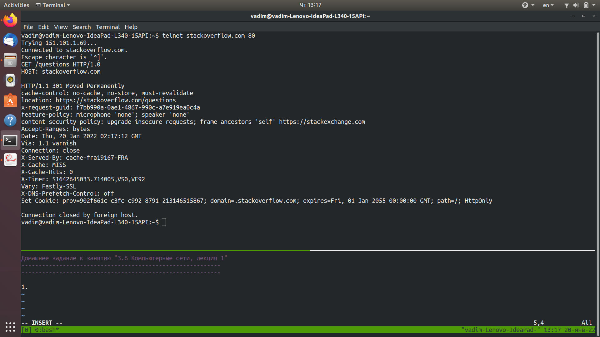
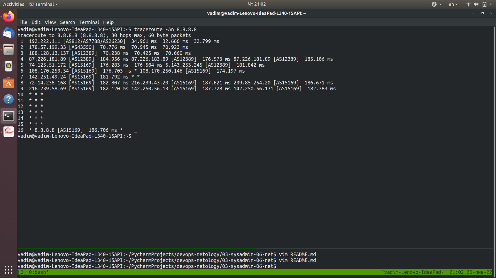

Домашнее задание к занятию "3.6 Компьютерные сети, лекция 1"
----------------------------------------------------------
----------------------------------------------------------  
  
1. В данном случае ответ сайта в коде html говорит о том, произошло перенаправление (redirection).  
Сайт доступен только по протоколу https ( такое перенаправление настраивается на серверах с момента перехода на https, 
который не транспортирует данные в открытом виде ).  
  
   
2. Первый ответ сервера на запрос http://stackoverflow.com:  
  
  
соответствующий этому ответу http код на вкладке `Headers`:  
  
  
страницу я грузил несколько раз, наблюдая время обработки запросов. До полной загрузки страницы всякий раз дольше всего отрабатывается запрос
, при котором происходит internal redirecting:  
  
  
3. Мой адрес в интернет:  
  
  
4. Последовательно выполняем сналача https://whoer.net/:  
  
  
затем:  
```bash
whois 178.57.199.34
 
% This is the RIPE Database query service.
% The objects are in RPSL format.
%
% The RIPE Database is subject to Terms and Conditions.
% See http://www.ripe.net/db/support/db-terms-conditions.pdf

% Note: this output has been filtered.
%       To receive output for a database update, use the "-B" flag.

% Information related to '178.57.199.0 - 178.57.199.255'

% Abuse contact for '178.57.199.0 - 178.57.199.255' is 'ripencc@dsc.ru'

inetnum:        178.57.199.0 - 178.57.199.255
netname:        DALSATCOM-IPv4
descr:          DalSatCom LTD
country:        RU
admin-c:        AD15010-RIPE
tech-c:         AS42254-RIPE
status:         ASSIGNED PA
mnt-by:         DALSATCOM-MNT
mnt-lower:      DALSATCOM-MNT
mnt-routes:     DALSATCOM-MNT
created:        2013-11-18T05:00:17Z
last-modified:  2021-03-09T08:10:49Z
source:         RIPE # Filtered

person:         ANDREY DOLGUSHEV
address:        693008, 137A, Amurskaya Str., Yuzhno-Sakhalinsk, Russia
phone:          +74242499302
nic-hdl:        AD15010-RIPE
mnt-by:         DALSATCOM-MNT
created:        2019-02-27T03:33:43Z
last-modified:  2019-02-27T03:33:43Z
source:         RIPE

person:         ALEKSANDER SEVRYUKOV
address:        693008, 137A, Amurskaya Str., Yuzhno-Sakhalinsk, Russia
phone:          +74242498425
nic-hdl:        AS42254-RIPE
mnt-by:         DALSATCOM-MNT
created:        2019-02-27T03:32:02Z
last-modified:  2019-02-27T03:32:02Z
source:         RIPE

% Information related to '178.57.199.0/24AS43550'

route:          178.57.199.0/24
descr:          DalSatCom Customer Network
origin:         AS43550
mnt-by:         DALSATCOM-MNT
created:        2013-11-18T06:33:30Z
last-modified:  2013-11-18T06:33:30Z
source:         RIPE # Filtered

% This query was served by the RIPE Database Query Service version 1.102.2 (HEREFORD)
```  
этот IP-адрес принадлежит провайдеру DalSatCom LTD, номер AS: AS43550
  
5. Пакет, отправленный с моего комьютера проходит на втором прыжке AS провайдера, а затем довольно быстро оказывается в AS google ( на 5-м )  
прыжке, проходя всего два промежуточных узла в AS, транслирующей данные от провайдера в AS google ( 8.8.8.8 - это DNS сервер google ):  
  
  
6. Результат выполнения `mtr -zn 8.8.8.8`:  
  
Наибольшая задержка имеет место быть внутри AS google ( при прыжках между ее узлами ).  
  
7. Выполним:  
```bash
dig +trace @8.8.8.8 dns.google
; <<>> DiG 9.11.3-1ubuntu1.16-Ubuntu <<>> +trace @8.8.8.8 dns.google
; (1 server found)
;; global options: +cmd
.			40766	IN	NS	m.root-servers.net.
.			40766	IN	NS	b.root-servers.net.
.			40766	IN	NS	c.root-servers.net.
.			40766	IN	NS	d.root-servers.net.
.			40766	IN	NS	e.root-servers.net.
.			40766	IN	NS	f.root-servers.net.
.			40766	IN	NS	g.root-servers.net.
.			40766	IN	NS	h.root-servers.net.
.			40766	IN	NS	a.root-servers.net.
.			40766	IN	NS	i.root-servers.net.
.			40766	IN	NS	j.root-servers.net.
.			40766	IN	NS	k.root-servers.net.
.			40766	IN	NS	l.root-servers.net.
.			40766	IN	RRSIG	NS 8 0 518400 20220201170000 20220119160000 9799 . EQsFc/CIjD3nVBQMy9yI5gtkepA4WVUUrHY5A1TV428UQgvnVFMVsSlt NAxHtVtkDrffatKxvmS5UwI8LA5BirRO2+tSK3sjrCrG+6RgY7uZB4dI O0AsltyBRAT00ZlBmfd2infEXN2DzZNFllJfxdfNEJhySPjJqiVDSS5Q Q70W8v3AQGWDMzv82GlAw3Kh8QzW/mUzKLH5RzcBeIfHdl4FhnWzU/eb lwa8Jek6eskg89f3I0A6J6ARFyaSwO3nsTW4SSEohAt5pS5FFThzvrbJ rk4wqnjGo3vFFwS8BzWONJjK24hyOAETDPba1iikibOmw5LSU2v36Aj0 eqsCnQ==
;; Received 525 bytes from 8.8.8.8#53(8.8.8.8) in 204 ms

google.			172800	IN	NS	ns-tld4.charlestonroadregistry.com.
google.			172800	IN	NS	ns-tld5.charlestonroadregistry.com.
google.			172800	IN	NS	ns-tld2.charlestonroadregistry.com.
google.			172800	IN	NS	ns-tld1.charlestonroadregistry.com.
google.			172800	IN	NS	ns-tld3.charlestonroadregistry.com.
google.			86400	IN	DS	6125 8 2 80F8B78D23107153578BAD3800E9543500474E5C30C29698B40A3DB2 3ED9DA9F
google.			86400	IN	RRSIG	DS 8 1 86400 20220202050000 20220120040000 9799 . Xe/o5Gid3N0+vLVCZMCeF2thAQSAPvbmLwktUFbV4wdFQQhiiglgvD3u QOv4y5TddCpKM0KITar7q6wkV2pwUoIJxHHWC+FtCz8Ok9L4uHfIn7ti Zg0tJf1BSIbZLywkWa20O96BqOxQEyzNkKoMJeciOwE4T7Cuu+FPS1NX GubDfJ/xHUbXGojRD2Sd3TavuRnTs8BGGP5qNaO2f+95y3IgqP0XyRKp I0DTSNr6Hr3dWI/ZT6lTtwa4b8NfgUB989HWdcY5pazRpCdyJ9coq8tv eQqKKchK7CnN27Ehf/02z9aJGjzRbMBv+xGYBom7Vpq0UF0AeAVv0xzV 49zZ5A==
;; Received 730 bytes from 202.12.27.33#53(m.root-servers.net) in 108 ms

dns.google.		10800	IN	NS	ns2.zdns.google.
dns.google.		10800	IN	NS	ns3.zdns.google.
dns.google.		10800	IN	NS	ns1.zdns.google.
dns.google.		10800	IN	NS	ns4.zdns.google.
dns.google.		3600	IN	DS	56044 8 2 1B0A7E90AA6B1AC65AA5B573EFC44ABF6CB2559444251B997103D2E4 0C351B08
dns.google.		3600	IN	RRSIG	DS 8 2 3600 20220209183845 20220118183845 15006 google. EoczPZ7g9xvjKjOXJynnAUvKieo9ncB6yL0NLZ9s7Kl2yjbT+uDcCphN VvV+tZpe9qVnTYvJU8Xk5hKPblkPKa52svTJ03FHCWQ5iFQ4b4Q0u/HE leAGyq3QKW45frrBOdDOw6vB4C+ybahB1uhQvWn4BxUxxMAKlP7pVobJ lY0=
;; Received 506 bytes from 216.239.38.105#53(ns-tld4.charlestonroadregistry.com) in 246 ms

dns.google.		900	IN	A	8.8.4.4
dns.google.		900	IN	A	8.8.8.8
dns.google.		900	IN	RRSIG	A 8 2 900 20220209182518 20220118182518 1773 dns.google. lGAcMMvgA+dhxdbxEuNjGKSqYfoCStX9hk5IGiz5/7XLGKuFD2LJ8EVF iyJHbcPRb+slAQvYpvyeyGq382Qw+9ZJB7CwHZa4k1k7YwovUJ7OevAJ c2/VJQtYn44any7OzgrDIhqN7Eq2j74r/qTTOJhbBM9rOTldO5LHIRiS Zlw=
;; Received 241 bytes from 216.239.32.114#53(ns1.zdns.google) in 330 ms
```
видим, что за `dns.google` отвечают сервера в перечне ниже:  
ns2.zdns.google  
ns3.zdns.google  
ns1.zdns.google  
ns4.zdns.google  
8.8.4.4  
8.8.8.8  
, последние два IP-адреса в этом перечне( 8.8.8.8, 8.8.4.4 ) являются также частями А записей, отвечающих за `dns.google`  
  
8. Проверяем PTR записи для IP адресов из задания 7:
```bash
dig -x 8.8.8.8
; <<>> DiG 9.11.3-1ubuntu1.16-Ubuntu <<>> -x 8.8.8.8
;; global options: +cmd
;; Got answer:
;; ->>HEADER<<- opcode: QUERY, status: NOERROR, id: 60793
;; flags: qr rd ra; QUERY: 1, ANSWER: 1, AUTHORITY: 0, ADDITIONAL: 1

;; OPT PSEUDOSECTION:
; EDNS: version: 0, flags:; udp: 65494
;; QUESTION SECTION:
;8.8.8.8.in-addr.arpa.		IN	PTR

;; ANSWER SECTION:
8.8.8.8.in-addr.arpa.	6979	IN	PTR	dns.google.

;; Query time: 0 msec
;; SERVER: 127.0.0.53#53(127.0.0.53)
;; WHEN: Fri Jan 21 10:44:53 +11 2022
;; MSG SIZE  rcvd: 73
```  
и:  
```bash
dig -x 8.8.4.4
; <<>> DiG 9.11.3-1ubuntu1.16-Ubuntu <<>> -x 8.8.4.4
;; global options: +cmd
;; Got answer:
;; ->>HEADER<<- opcode: QUERY, status: NOERROR, id: 55492
;; flags: qr rd ra; QUERY: 1, ANSWER: 1, AUTHORITY: 0, ADDITIONAL: 1

;; OPT PSEUDOSECTION:
; EDNS: version: 0, flags:; udp: 65494
;; QUESTION SECTION:
;4.4.8.8.in-addr.arpa.		IN	PTR

;; ANSWER SECTION:
4.4.8.8.in-addr.arpa.	64341	IN	PTR	dns.google.

;; Query time: 113 msec
;; SERVER: 127.0.0.53#53(127.0.0.53)
;; WHEN: Fri Jan 21 10:46:48 +11 2022
;; MSG SIZE  rcvd: 73
```
  
к обеим IP привязано доменное имя `dns.google`


