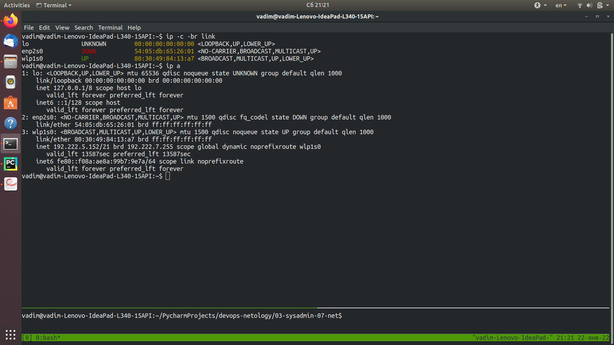
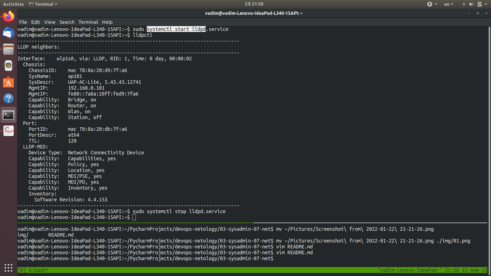

Домашнее задание к занятию "3.6 Компьютерные сети, лекция 2"
----------------------------------------------------------
----------------------------------------------------------  
  
1. Для Linux это команды `ip link`, `ip a`:  

  
   Для Windows `ipconfig /all`  
  
2. Для распознавания соседа по сетевому интерфейсу используется Link Layer Discovery Protocol. В Linux для этого есть пакет lldpd. 
Это демон, используемый для приема/передачи LLDP фреймов. Он управляется командами lldpcli, lldpctl.
Для запуска используется команда `sudo systemctl start lldpd`:  


Можно его также поместить в автозагрузку ( `sudo systemctl enable lldpd` ).
  
3. Для разделения L2 коммутатора на несколько виртуальных сетей используется технология VLAN.  
В Linux для этого используются пакет vlan, команда vconfig. Особенностью использования пакета является то, что после загрузки Linux,
происходит обработка файла /etc/network/interfaces. Файл содержит информацию для конфигурации сетевых интерфейсов командами  
`ifup`, `ifdown`. Таким образом, сконфигурированные в этом файле vlan, сохраняются при перезагрузке ОС.
Один из простейших примеров конфига для Debian GNU/Linux представлен в документации на сайте http://xgu.ru/wiki/VLAN: 
  
```bash
iface vlan1400 inet static
	address 192.168.1.1
	netmask 255.255.255.0
	vlan_raw_device eth0
```  
либо можно использовать вариант конфига без опции raw-device ( описан в man 5 vlan-interfaces ):  
```bash
iface eth0.1400 inet static
	address 192.168.1.1
	netmask 255.255.255.0
```
и в том, и в другом случае будет создан vlan интерфейс с номером 1400 ( диапазон доступных номеров от 1 до 4095 ).  
Именно 4095 (!) указано в man 5 vlan-interfaces.  
  
4. Агрегацию в Linux обеспечивает драйвер bonding ядра linux. Поведение агрегированных ("bonded") интерфейсов зависит от режима ("mode").  
Проще говоря, режимы обеспечивают либо балансировку нагрузки, либо горячий резерв.  
Типы агрегации (объединения) интерфейсов в Linux:  
  
mode=0 (balance-rr)  
Этот режим используется по-умолчанию, если в настройках не указано другое. balance-rr обеспечивает балансировку нагрузки и отказоустойчивость. В данном режиме пакеты отправляются "по кругу" от первого интерфейса к последнему и сначала. Если выходит из строя один из интерфейсов, пакеты отправляются на остальные оставшиеся.При подключении портов к разным коммутаторам, требует их настройки.  
  
mode=1 (active-backup)  
При active-backup один интерфейс работает в активном режиме, остальные в ожидающем. Если активный падает, управление передается одному из ожидающих. Не требует поддержки данной функциональности от коммутатора.  
  
mode=2 (balance-xor)  
Передача пакетов распределяется между объединенными интерфейсами по формуле ((MAC-адрес источника) XOR (MAC-адрес получателя)) % число интерфейсов. Один и тот же интерфейс работает с определённым получателем. Режим даёт балансировку нагрузки и отказоустойчивость.  
  
mode=3 (broadcast)  
Происходит передача во все объединенные интерфейсы, обеспечивая отказоустойчивость.  
  
mode=4 (802.3ad)  
Это динамическое объединение портов. В данном режиме можно получить значительное увеличение пропускной способности как входящего так и исходящего трафика, используя все объединенные интерфейсы. Требует поддержки режима от коммутатора, а так же (иногда) дополнительную настройку коммутатора.  
  
mode=5 (balance-tlb)  
Адаптивная балансировка нагрузки. При balance-tlb входящий трафик получается только активным интерфейсом, исходящий - распределяется в зависимости от текущей загрузки каждого интерфейса. Обеспечивается отказоустойчивость и распределение нагрузки исходящего трафика. Не требует специальной поддержки коммутатора.  
  
mode=6 (balance-alb)  
Адаптивная балансировка нагрузки (более совершенная). Обеспечивает балансировку нагрузки как исходящего (TLB, transmit load balancing), так и входящего трафика (для IPv4 через ARP). Не требует специальной поддержки коммутатором, но требует возможности изменять MAC-адрес устройства.  

Опции передаются в качестве параметров драйверу "bonding" во время загрузки модуля. Они могут передаваться в качестве аргументов командной строки утилите insmod, но обычно указываются в одном из конфигурационных файлов: /etc/modules.conf или /etc/modprobe.conf, или файле, специфичном для конкретного дистрибутива.  
Для Ubuntu это - /etc/network/interfaces.  

Как следует из описания "https://www.kernel.org/doc/Documentation/networking/bonding.txt", динамический режим LAG ( под контролем LACP ) возможен  
при выборе mode=4 (802.3ad). Все остальные режимы статические ( требуют ручной настройки ).  
   
Теперь перейдем к примеру Cisco:  
В ОС Cisco 3 вида агрегирования:

    1) LACP или Link Aggregation Control Protocol — это открытый стандарт IEEE.
    2) PAgP или Port Aggregation Protocol — проприетарный протокол Cisco.
    Ручное агрегирование.

Все 3 вида агрегирования будут выполнены только в следующих случаях:

    Одинаковый Duplex
    Одинаковая скорость интерфейсов
    Одинаковые разрешенные VLAN-ы и Native VLAN
    Одинаковый режим интерфейсов (access, trunk)


То есть порты должны быть идентичны друг другу.

Теперь об их отличии. Первые 2 позволяют динамически согласоваться и в случае отказа какого-то из линков уведомить об этом.

В Cisco ручное агрегирование делается на страх и риск администратора. Коммутаторы не будут ничего согласовывать и будут полагаться на то, что администратор все предусмотрел. Несмотря на это, многие вендоры рекомендуют использовать именно ручное агрегирование, так как в любом случае для правильной работы должны быть соблюдены правила, описанные выше, а коммутаторам не придется генерировать служебные сообщения для согласования LACP или PAgP.

Балансировка нагрузки возможна в Linux bonding ( суть ee - конфигурация драйвера bonding ):  
при выборе mode=0 ( передача "по кругу" )
в режиме есть опции: 
```bash
packets_per_slave ( 0 - интерфейс выбирается рандомно, 1 - 65535 сколько передать пакетов на текущий интерфейс, перед переходом к следующему )
```
при выборе mode=2 ( каждый интерфейс может работать со своим получателем )  
при выборе mode=5 ( только исходящего траффика - между агреггированными интерфейсами )  
при выборе mode=6 ( исходящего/входящего траффика - между агреггированными интерфейсами)

опция xmit_hash_policy ( используется в режимах balance-xor, 802.3ad, и tlb ) - Selects the transmit hash policy to use for slave selection / 
то есть можно выбрать политику ( правило ) вычисления номеров подчиненных сетевых интерфейсов, через которые будет идти передача  
   
Что касается конфигурирования, то возможно использование ifenslave ( конфигурирование с использованием interfaces - 
как правило актуально для дистрибутивов Debian и их производных ), либо systems-networkd ( как более универсального для разных дистрибутивов ).
В документации есть деление по видам конфигурирования: через interfaces, через initscripts, через Sysconfig.

Для Ubuntu применимо конфигурирование посредством модификации /etc/network/interfaces. 
Пример простейшей конфигурации для ноутбука с агрегацией сетевых интерфейсов WiFi и Wired LAN:  
```bash
# Define slaves   
auto eth0
iface eth0 inet manual
    bond-master bond0
    bond-primary eth0
    bond-mode active-backup
   
auto wlan0
iface wlan0 inet manual
    wpa-conf /etc/network/wpa.conf
    bond-master bond0
    bond-primary eth0
    bond-mode active-backup

# Define master
auto bond0
iface bond0 inet dhcp
    bond-slaves none
    bond-primary eth0
    bond-mode active-backup
    bond-miimon 100
```
   
5. В сети с маской /29 имеется всего 8 адресов ( 6 - для узлов, 1 - адрес сети, 1 - широковещательный адрес ).
Из сети с маской /24 можно получить 32 штуки /29 подсети.  
Примеры /29 подсетей внутри сети 10.10.10.0/24:
```bash
ipcalc 10.10.10.0/24
Address:   10.10.10.0           00001010.00001010.00001010. 00000000
Netmask:   255.255.255.0 = 24   11111111.11111111.11111111. 00000000
Wildcard:  0.0.0.255            00000000.00000000.00000000. 11111111
=>
Network:   10.10.10.0/24        00001010.00001010.00001010. 00000000
HostMin:   10.10.10.1           00001010.00001010.00001010. 00000001
HostMax:   10.10.10.254         00001010.00001010.00001010. 11111110
Broadcast: 10.10.10.255         00001010.00001010.00001010. 11111111
Hosts/Net: 254                   Class A, Private Internet
```
Итого, для этой сети с 254 узлами и 256 адресами могут быть доступны /29 подсети:  
10.10.10.0/29, 10.10.10.8/29, 10.10.10.16/29, 10.10.10.240/29, 10.10.10.248/29

6. Возьмем оставшийся доступный диапазон частных подсетей: 100.64.0.0 — 100.127.255.255
   Выберем сеть: 100.64.0.0
   Используя ipcalc, получим:

```bash
ipcalc -b --split 40 100.64.0.0/10
Address:   100.64.0.0           
Netmask:   255.192.0.0 = 10     
Wildcard:  0.63.255.255         
=>
Network:   100.64.0.0/10        
HostMin:   100.64.0.1           
HostMax:   100.127.255.254      
Broadcast: 100.127.255.255      
Hosts/Net: 4194302               Class A

1. Requested size: 40 hosts
Netmask:   255.255.255.192 = 26 
Network:   100.64.0.0/26        
HostMin:   100.64.0.1           
HostMax:   100.64.0.62          
Broadcast: 100.64.0.63          
Hosts/Net: 62                    Class A

Needed size:  64 addresses.
Used network: 100.64.0.0/26
Unused:
100.64.0.64/26
100.64.0.128/25
100.64.1.0/24
100.64.2.0/23
100.64.4.0/22
100.64.8.0/21
100.64.16.0/20
100.64.32.0/19
100.64.64.0/18
100.64.128.0/17
100.65.0.0/16
100.66.0.0/15
100.68.0.0/14
100.72.0.0/13
100.80.0.0/12
100.96.0.0/11
```

7. Команда `arp -a` в обеих ОС выполнит одно и то же: выведет ARP таблицу.
   ARP states for Address Resolution Protocol. Однако в Линукс предпочтительней
   может быть использовать `arp -e` - это стиль Линукс по умолчанию, тогда как ключ
   -a даст вывод, применяемый в BSD дистрибутивах. Также Линукс допускает
   использовать для этой цели команду `arp`.
   В Windows для очистки всей таблицы можно применить `arp d *`, для удаления
   одной записи `arp -d inet_addr`, где inet_addr - IP адрес.
   В Linux для очистки одного нужного IP из таблицы используется также `arp -d address`.
   Также в Линукс очистить всю таблицу можно командой `arp -d *`.
  

   

