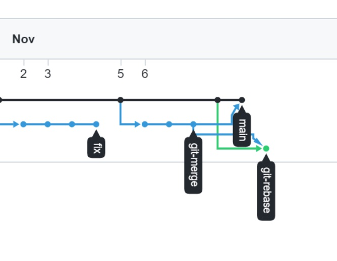
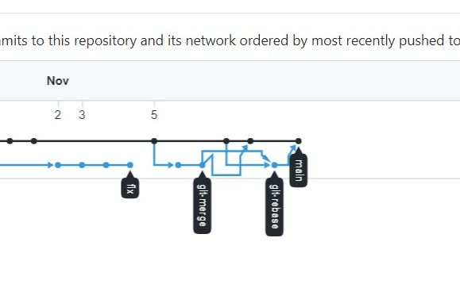

# devops-netology

Created by: Tormyshev Vadim / Тормышев Вадим

Домашнее задание к занятию «2.1. Системы контроля версий.»
----------------------------------------------------------
----------------------------------------------------------

Tue Oct 26 07:51:41 UTC 2021 | I have modified the file  
Tue Oct 26 07:58:30 UTC 2021 | I have modified the file after "git add" command was implemented to it  
Tue Oct 26 21:14:49 UTC 2021 | I have modified the file after "git restore --staged README.md" was implemented to it  

После создания каталога terraform и добавления в него файла
 .gitignore, содержащего описания правил игнорирования, будут проигнорированы
 файлы, указанные ниже: 

каждый путь, который будет начинаться внутри каталога terraform и будет иметь
имя каталога ".terraform" в конце и любые типы/количество файлов в каталоге ".terraform"

файл ./terraform/crash.log 

все файлы каталога terraform, которые будут иметь расширение "tfvars"

файлы override.tf, override.tf.json в каталоге terraform
файлы в каталоге terraform, имена которых заканчиваются последовательностями символов
'_override.tf', '_override.tf.json'

файлы '.terraformrc', 'terraform.rc' в каталоге terraform

Домашнее задание к занятию «2.2. Основы Git.»
----------------------------------------------------------
----------------------------------------------------------
    
github: https://github.com/ellikvt/devops-netology.git
  
gitlab: https://gitlab.com/ellikvt/devops-netology.git
  
bitbucket: https://ellikvt@bitbucket.org/ellikvt/netology.git
  
  
Домашнее задание к занятию «2.3. Ветвления в Git.»
----------------------------------------------------------
----------------------------------------------------------

  

Выполненное задание - в репозитории: https://github.com/ellikvt/devops-netology.git

В тексте задания допущена ошибка:
```bash
#!/bin/bash
# display command line options
count=1
for param in "$@"; do
<<<<<<< HEAD
    echo "\$@ Parameter #$count = $param"
=======
    echo "Parameter: $param"
>>>>>>> dc4688f... git 2.3 rebase @ instead *
    count=$(( $count + 1 ))
done
```
Удалим метки, отдав предпочтение варианту
```bash
echo "\$@ Parameter #$count = $param"
```
  
Если решить конфликт таким образом, то после rebase получим состояние:

  
Продолжая решать задание буквально и выполнив git merge git-rebase, получим состояние:

  
Если же разрешить конфликт при rebase, отдав предпочтение варианту:
```bash
echo "Parameter: $param"
```
то вычисляемая Гитом разница для выполнения rebase будет простой, так как будет выбран
вариант разрешения конфликта из более нового файла rebase из ветки git-rebase
  
При использовании `echo "\$@ Parameter #$count = $param"` для рарешения конфликта
Гиту приходится брать последнюю версию rebase.sh из main, которая старее rebase.sh 
из ветки git-rebase, коммит более старой версии находится к тому же перед коммитом первого 
мержа. Как последствия этого, Гит вычисляет разницу, используя два коммита из main 
, один из них - мерж коммит, также он "тянет" старые изменения и создает новые два коммита
на разных ветках (git-rebase and main) вместо одного коммита в main.
Затем попытка выполнить последний мерж уже происходит естественно рекурсивно и самое главное, 
что она также бесконфликтна и выполняется автоматически (применением) более новых изменений
в файлах rebase.sh и merge.sh. В результате в ветке main получим merge.sh с изменениями
не соответствующими его версии из первого мержа.


