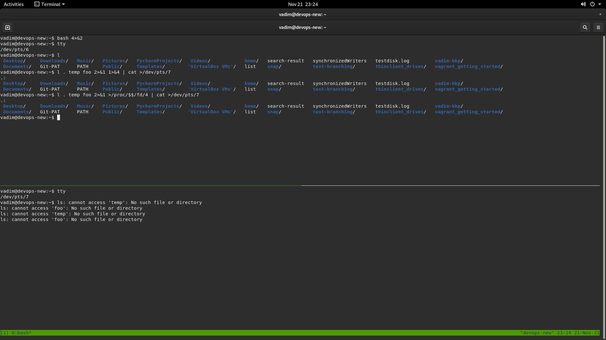

# devops-netology

Created by: Tormyshev Vadim / Тормышев Вадим

Домашнее задание к занятию «2.1. Системы контроля версий.»
----------------------------------------------------------
----------------------------------------------------------

Tue Oct 26 07:51:41 UTC 2021 | I have modified the file  
Tue Oct 26 07:58:30 UTC 2021 | I have modified the file after "git add" command was implemented to it  
Tue Oct 26 21:14:49 UTC 2021 | I have modified the file after "git restore --staged README.md" was implemented to it  

После создания каталога terraform и добавления в него файла
 .gitignore, содержащего описания правил игнорирования, будут проигнорированы
 файлы, указанные ниже: 

каждый путь, который будет начинаться внутри каталога terraform и будет иметь
имя каталога ".terraform" в конце и любые типы/количество файлов в каталоге ".terraform"

файл ./terraform/crash.log 

все файлы каталога terraform, которые будут иметь расширение "tfvars"

файлы override.tf, override.tf.json в каталоге terraform
файлы в каталоге terraform, имена которых заканчиваются последовательностями символов
'_override.tf', '_override.tf.json'

файлы '.terraformrc', 'terraform.rc' в каталоге terraform

Домашнее задание к занятию «2.2. Основы Git.»
----------------------------------------------------------
----------------------------------------------------------
    
github: https://github.com/ellikvt/devops-netology.git
  
gitlab: https://gitlab.com/ellikvt/devops-netology.git
  
bitbucket: https://ellikvt@bitbucket.org/ellikvt/netology.git
  
  
Домашнее задание к занятию «2.3. Ветвления в Git.»
----------------------------------------------------------
----------------------------------------------------------

  

Выполненное задание - в репозитории: https://github.com/ellikvt/devops-netology.git

В тексте задания допущена ошибка:
```bash
#!/bin/bash
# display command line options
count=1
for param in "$@"; do
<<<<<<< HEAD
    echo "\$@ Parameter #$count = $param"
=======
    echo "Parameter: $param"
>>>>>>> dc4688f... git 2.3 rebase @ instead *
    count=$(( $count + 1 ))
done
```
Удалим метки, отдав предпочтение варианту
```bash
echo "\$@ Parameter #$count = $param"
```
  
Если решить конфликт таким образом, то после rebase получим состояние:

  
Продолжая решать задание буквально и выполнив git merge git-rebase, получим состояние:

  
Если же разрешить конфликт при rebase, отдав предпочтение варианту:
```bash
echo "Parameter: $param"
```
то вычисляемая Гитом разница для выполнения rebase будет простой, так как будет выбран
вариант разрешения конфликта из более нового файла rebase из ветки git-rebase
  
При использовании `echo "\$@ Parameter #$count = $param"` для рарешения конфликта
Гиту приходится брать последнюю версию rebase.sh из main, которая старее rebase.sh 
из ветки git-rebase, коммит более старой версии находится к тому же перед коммитом первого 
мержа. Как последствия этого, Гит вычисляет разницу, используя два коммита из main 
, один из них - мерж коммит, также он "тянет" старые изменения и создает новые два коммита
на разных ветках (git-rebase and main) вместо одного коммита в main.
Затем попытка выполнить последний мерж уже происходит естественно рекурсивно и самое главное, 
что она также бесконфликтна и выполняется автоматически (применением) более новых изменений
в файлах rebase.sh и merge.sh. В результате в ветке main получим merge.sh с изменениями
не соответствующими его версии из первого мержа.
  
  
Домашнее задание к занятию «2.4. Инструменты Git»
----------------------------------------------------------
----------------------------------------------------------
  
1. hash=aefead2207ef7e2aa5dc81a34aedf0cad4c32545, получен командой
`git log | grep aefea`
Notes / Комментарии коммита:
```bash
diff --git a/CHANGELOG.md b/CHANGELOG.md
index 86d70e3e0..588d807b1 100644
--- a/CHANGELOG.md
+++ b/CHANGELOG.md
@@ -27,6 +27,7 @@ BUG FIXES:
 * backend/s3: Prefer AWS shared configuration over EC2 metadata credentials by default ([#25134](https://github.com/hashicorp/terraform/issues/25134))
 * backend/s3: Prefer ECS credentials over EC2 metadata credentials by default ([#25134](https://github.com/hashicorp/terraform/issues/25134))
 * backend/s3: Remove hardcoded AWS Provider messaging ([#25134](https://github.com/hashicorp/terraform/issues/25134))
+* command: Fix bug with global `-v`/`-version`/`--version` flags introduced in 0.13.0beta2 [GH-25277]
 * command/0.13upgrade: Fix `0.13upgrade` usage help text to include options ([#25127](https://github.com/hashicorp/terraform/issues/25127))
 * command/0.13upgrade: Do not add source for builtin provider ([#25215](https://github.com/hashicorp/terraform/issues/25215))
 * command/apply: Fix bug which caused Terraform to silently exit on Windows when using absolute plan path ([#25233](https://github.com/hashicorp/terraform/issues/25233))
```
Получены командой: git show aefead2207ef7e2aa5dc81a34aedf0cad4c32545 --pretty=format:'%N'
  
commit message: `Update CHANGELOG.md`
Получено командой git show aefead2207ef7e2aa5dc81a34aedf0cad4c32545
  
2. Ответ : `tag: v0.12.23`
   Получен командой: `git show 85024d3`
  
3. Ответ : 2 родителя ( 9ea88f22f и 56cd7859e )
   Можно получить при помощи: 
   ```bash
   git checkout b8d720
   git log --pretty=format:'%h %S' --graph
   ```
   И в дереве коммитов видно наглядно..
   А можно получить при помощи:
   `git show b8d720`, и в сообщении коммита есть ссылки на его родителей (их хэши) 
   а также информация, что это - мерж коммит.
   
4. Ответ:
```bash
commit 33ff1c03bb960b332be3af2e333462dde88b279e
Author: tf-release-bot <terraform@hashicorp.com>
Date:   Thu Mar 19 15:04:05 2020 +0000

    v0.12.24

commit b14b74c4939dcab573326f4e3ee2a62e23e12f89
Author: Chris Griggs <cgriggs@hashicorp.com>
Date:   Tue Mar 10 08:59:20 2020 -0700

    [Website] vmc provider links

commit 3f235065b9347a758efadc92295b540ee0a5e26e
Author: Alisdair McDiarmid <alisdair@users.noreply.github.com>
Date:   Thu Mar 19 10:39:31 2020 -0400

    Update CHANGELOG.md

commit 6ae64e247b332925b872447e9ce869657281c2bf
Author: Alisdair McDiarmid <alisdair@users.noreply.github.com>
Date:   Thu Mar 19 10:20:10 2020 -0400

    registry: Fix panic when server is unreachable
    
    Non-HTTP errors previously resulted in a panic due to dereferencing the
    resp pointer while it was nil, as part of rendering the error message.
    This commit changes the error message formatting to cope with a nil
    response, and extends test coverage.
    
    Fixes #24384

commit 5c619ca1baf2e21a155fcdb4c264cc9e24a2a353
Author: Nick Fagerlund <nick.fagerlund@gmail.com>
Date:   Wed Mar 18 12:30:20 2020 -0700

    website: Remove links to the getting started guide's old location
    
    Since these links were in the soon-to-be-deprecated 0.11 language section, I
    think we can just remove them without needing to find an equivalent link.

commit 06275647e2b53d97d4f0a19a0fec11f6d69820b5
Author: Alisdair McDiarmid <alisdair@users.noreply.github.com>
Date:   Wed Mar 18 10:57:06 2020 -0400

    Update CHANGELOG.md

commit d5f9411f5108260320064349b757f55c09bc4b80
Author: Alisdair McDiarmid <alisdair@users.noreply.github.com>
Date:   Tue Mar 17 13:21:35 2020 -0400

    command: Fix bug when using terraform login on Windows

commit 4b6d06cc5dcb78af637bbb19c198faff37a066ed
Author: Pam Selle <pam@hashicorp.com>
Date:   Tue Mar 10 12:04:50 2020 -0400

    Update CHANGELOG.md

commit dd01a35078f040ca984cdd349f18d0b67e486c35
Author: Kristin Laemmert <mildwonkey@users.noreply.github.com>
Date:   Thu Mar 5 16:32:43 2020 -0500

    Update CHANGELOG.md

commit 225466bc3e5f35baa5d07197bbc079345b77525e
Author: tf-release-bot <terraform@hashicorp.com>
Date:   Thu Mar 5 21:12:06 2020 +0000

    Cleanup after v0.12.23 release

commit 85024d3100126de36331c6982bfaac02cdab9e76
Author: tf-release-bot <terraform@hashicorp.com>
Date:   Thu Mar 5 20:56:10 2020 +0000

    v0.12.23
```
Получен командой : `git log v0.12.23~..v0.12.24`. Но для начала выполнена команда:
```bash
git log v0.12.23~..v0.12.24 --oneline
    
33ff1c03b v0.12.24
b14b74c49 [Website] vmc provider links
3f235065b Update CHANGELOG.md
6ae64e247 registry: Fix panic when server is unreachable
5c619ca1b website: Remove links to the getting started guide's old location
06275647e Update CHANGELOG.md
d5f9411f5 command: Fix bug when using terraform login on Windows
4b6d06cc5 Update CHANGELOG.md
dd01a3507 Update CHANGELOG.md
225466bc3 Cleanup after v0.12.23 release
85024d310 v0.12.23
```
Для понимания объема, содержания, наглядности.
  
5. Команда `git grep -p 'func providerSource'` выдаст имена файлов и функции, 
   где присутствует совпадение   В данном случае совпадений немного и все они 
   в файле с одним и тем же именем provider_source.go.
   Теперь, применив `git log -L :'func providerSource':provider_source.go`, 
   получим в выводе три коммита, в которых func providerSource описывалась. 
   Видно, что она впервые появилась в 8c928e83589d90a031f811fae52a81be7153e82f,
   затем разработчик дописал ее тело, указав оператор возврата из функции return 
   и откорректировав комментарии в ее теле. В коммите 
   5af1e6234ab6da412fb8637393c5a17a1b293663 функция окончательно отредактирована.
  
6. Выведем результат выполнения `git grep -c -p globalPluginDirs`:
```bash
commands.go:2
internal/command/cliconfig/config_unix.go:1
plugins.go:2
```
   Итого: 5 коммитов. Используем имена файлов для поиска всех коммитов, где 
   globalPluginDirs менялась:
```bash
 git log -L:globalPluginDirs:plugins.go && git log -L:globalPluginDirs:internal/command/cliconfig/config_unix.go && git log -L:globalPluginDirs:commands.go
```
  и получим эти 5 коммитов:
  78b12205587fe839f10d946ea3fdc06719decb05  
  52dbf94834cb970b510f2fba853a5b49ad9b1a46  
  41ab0aef7a0fe030e84018973a64135b11abcd70  
  66ebff90cdfaa6938f26f908c7ebad8d547fea17  
  8364383c359a6b738a436d1b7745ccdce178df47  
  
7. Используем git log: 
```bash
git log -S synchronizedWriters --oneline --pretty=format:'%h %s %ad'
bdfea50cc remove unused Mon Nov 30 18:02:04 2020 -0500
fd4f7eb0b remove prefixed io Wed Oct 21 13:06:23 2020 -0400
5ac311e2a main: synchronize writes to VT100-faker on Windows Wed May 3 16:25:41 2017 -0700
```
  
Таким образом работа с кодом функции была в 3 коммитах.
Затем посмотрим в каких коммитах и каким образом функция редактировалась:
```bash
git show bdfea50cc | grep synchronizedWriters && echo '---' && git show fd4f7eb0b | grep synchronizedWriters && echo '---' && git show 5ac311e2a | grep synchronizedWriters

-// synchronizedWriters takes a set of writers and returns wrappers that ensure
-func synchronizedWriters(targets ...io.Writer) []io.Writer {
---
-               wrapped := synchronizedWriters(stdout, stderr)
---
+               wrapped := synchronizedWriters(stdout, stderr)
+// synchronizedWriters takes a set of writers and returns wrappers that ensure
+func synchronizedWriters(targets ...io.Writer) []io.Writer {
```
Видим, что она добавлена впервые в коммит 5ac311e2a.
Теперь если попробуем использовать: `git blame synchronizedWriters` то мы не получим никакого
результата, даже используя ключи -С или -М. Вообще анализируя все три коммита найденные ранее,
можно сразу видеть странное наличие функции synchronizedWriters в коде. К тому же она была
в конце концов удалена как неиспользуемая, судя по `bdfea50cc remove unused Mon Nov 30 18:02:04 2020 -0500`.
Если почитать документацию по git blame, git log, то в man git blame есть рекомендация - 
использовать git log --diff-filter в случаях, когда строки в искомых файлах были что называется сделаны простой копи-пастой из уже сушествующих файлов. Иногда это бывает из-за небрежности разработчика и плохого
рефакторинга кода:
```bash
git log --diff-filter=A --pretty=short -- synchronized_writers.go

commit 5ac311e2a91e381e2f52234668b49ba670aa0fe5
Author: Martin Atkins <mart@degeneration.co.uk>
  
 main: synchronize writes to VT100-faker on Windows
```
  
выполнив `git show 5ac311e2a --pretty=format: '%an %cn', получим:
```bash

Martin Atkins Martin Atkins
diff --git a/main.go b/main.go
index b94de2ebc..237581200 100644
--- a/main.go
+++ b/main.go
@@ -258,6 +258,15 @@ func copyOutput(r io.Reader, doneCh chan<- struct{}) {
 	if runtime.GOOS == "windows" {
 		stdout = colorable.NewColorableStdout()
 		stderr = colorable.NewColorableStderr()
+
+		// colorable is not concurrency-safe when stdout and stderr are the
+		// same console, so we need to add some synchronization to ensure that
+		// we can't be concurrently writing to both stderr and stdout at
+		// once, or else we get intermingled writes that create gibberish
+		// in the console.
+		wrapped := synchronizedWriters(stdout, stderr)
+		stdout = wrapped[0]
+		stderr = wrapped[1]
 	}
 
 	var wg sync.WaitGroup
diff --git a/synchronized_writers.go b/synchronized_writers.go
new file mode 100644
index 000000000..2533d1316
--- /dev/null
+++ b/synchronized_writers.go
@@ -0,0 +1,31 @@
+package main
+
+import (
+	"io"
+	"sync"
+)
+
+type synchronizedWriter struct {
+	io.Writer
+	mutex *sync.Mutex
+}
+
+// synchronizedWriters takes a set of writers and returns wrappers that ensure
+// that only one write can be outstanding at a time across the whole set.
+func synchronizedWriters(targets ...io.Writer) []io.Writer {
+	mutex := &sync.Mutex{}
+	ret := make([]io.Writer, len(targets))
+	for i, target := range targets {
+		ret[i] = &synchronizedWriter{
+			Writer: target,
+			mutex:  mutex,
+		}
+	}
+	return ret
+}
+
+func (w *synchronizedWriter) Write(p []byte) (int, error) {
+	w.mutex.Lock()
+	defer w.mutex.Unlock()
+	return w.Writer.Write(p)
+}
```
таким образом здесь можно адресовать свои вопросы только товарищу Martin Atkins.
  
Домашнее задание к занятию «3.1. Работа в терминале, лекция 1»
----------------------------------------------------------
----------------------------------------------------------
  
Операционная система на хосте - Ubuntu 18.03 LTS:

   
1. Установлена VirtualBox: 
   
  
2. Установлен Vagrant:
  
  
3. Используем встроенный терминал и мультиплексор tmux:
  
  
4. Конфигурирование Vagrantfile и запуск ВМ:
   
  
   Запуск невозможен, т.к. вложенная виртуализация не поддерживается:
   
  
  Я ограничен в аппаратных ресурсах, так как нахожусь в командировке на морском объекте.
  Я написал координатору об этом и ответа не получил пока. Все чем я могу пользоватся
  в ближайший месяц - это платформы виртуализации. Поэтому я выполняю задания на 
  арендованных YandexVM. Вложенная виртуализация не поддерживается, о чем есть письмо
  из их техподдержки. Компьютера с платформой, которая совместима с 
  hardware virtualization technology у меня здесь нет. На рабочие машины ставить ничего 
  не разрешается. Поэтому дальнейшие шаги задания выполняю на Яндекс ВМ Ubuntu 20.04.
  Предыдущие задания по курсу выполнены также на этой ВМ.
  
5. Перечень аппратных ресурсов можно получить их сведений о ВМ, выполнив:
```bash

$ VBoxManage showvminfo vagrant_getting_started_default_1636852324301_49394 
 
Name:                        vagrant_getting_started_default_1636852324301_49394
Groups:                      /
Guest OS:                    Ubuntu (64-bit)
UUID:                        b65d3b19-7987-4caf-83fb-87bae95a2959
Config file:                 /home/vadim/VirtualBox VMs/vagrant_getting_started_default_1636852324301_49394/vagrant_getting_started_default_1636852324301_49394.vbox
Snapshot folder:             /home/vadim/VirtualBox VMs/vagrant_getting_started_default_1636852324301_49394/Snapshots
Log folder:                  /home/vadim/VirtualBox VMs/vagrant_getting_started_default_1636852324301_49394/Logs
Hardware UUID:               b65d3b19-7987-4caf-83fb-87bae95a2959
Memory size:                 1024MB
Page Fusion:                 disabled
VRAM size:                   4MB
CPU exec cap:                100%
HPET:                        disabled
CPUProfile:                  host
Chipset:                     piix3
Firmware:                    BIOS
Number of CPUs:              2
PAE:                         enabled
Long Mode:                   enabled
Triple Fault Reset:          disabled
APIC:                        enabled
X2APIC:                      enabled
Nested VT-x/AMD-V:           disabled
CPUID Portability Level:     0
CPUID overrides:             None
Boot menu mode:              message and menu
Boot Device 1:               HardDisk
Boot Device 2:               DVD
Boot Device 3:               Not Assigned
Boot Device 4:               Not Assigned
ACPI:                        enabled
IOAPIC:                      enabled
BIOS APIC mode:              APIC
Time offset:                 0ms
RTC:                         UTC
Hardware Virtualization:     enabled
Nested Paging:               enabled
Large Pages:                 enabled
VT-x VPID:                   enabled
VT-x Unrestricted Exec.:     enabled
Paravirt. Provider:          Default
Effective Paravirt. Prov.:   KVM
State:                       powered off (since 2021-11-14T14:07:41.000000000)
Graphics Controller:         VBoxVGA
Monitor count:               1
3D Acceleration:             disabled
2D Video Acceleration:       disabled
Teleporter Enabled:          disabled
Teleporter Port:             0
Teleporter Address:          
Teleporter Password:         
Tracing Enabled:             disabled
Allow Tracing to Access VM:  disabled
Tracing Configuration:       
Autostart Enabled:           disabled
Autostart Delay:             0
Default Frontend:            
VM process priority:         default
Storage Controller Name (0):            IDE Controller
Storage Controller Type (0):            PIIX4
Storage Controller Instance Number (0): 0
Storage Controller Max Port Count (0):  2
Storage Controller Port Count (0):      2
Storage Controller Bootable (0):        on
Storage Controller Name (1):            SATA Controller
Storage Controller Type (1):            IntelAhci
Storage Controller Instance Number (1): 0
Storage Controller Max Port Count (1):  30
Storage Controller Port Count (1):      1
Storage Controller Bootable (1):        on
SATA Controller (0, 0): /home/vadim/VirtualBox VMs/vagrant_getting_started_default_1636852324301_49394/ubuntu-20.04-amd64-disk001.vmdk (UUID: ab7d8c05-321c-40b0-9b04-d7bd13e7dda4)
NIC 1:                       MAC: 0800277360CF, Attachment: NAT, Cable connected: on, Trace: off (file: none), Type: 82540EM, Reported speed: 0 Mbps, Boot priority: 0, Promisc Policy: deny, Bandwidth group: none
NIC 1 Settings:  MTU: 0, Socket (send: 64, receive: 64), TCP Window (send:64, receive: 64)
NIC 1 Rule(0):   name = ssh, protocol = tcp, host ip = 127.0.0.1, host port = 2222, guest ip = , guest port = 22
NIC 2:                       disabled
NIC 3:                       disabled
NIC 4:                       disabled
NIC 5:                       disabled
NIC 6:                       disabled
NIC 7:                       disabled
NIC 8:                       disabled
Pointing Device:             PS/2 Mouse
Keyboard Device:             PS/2 Keyboard
UART 1:                      disabled
UART 2:                      disabled
UART 3:                      disabled
UART 4:                      disabled
LPT 1:                       disabled
LPT 2:                       disabled
Audio:                       disabled
Audio playback:              disabled
Audio capture:               disabled
Clipboard Mode:              disabled
Drag and drop Mode:          disabled
VRDE:                        enabled (Address 127.0.0.1, Ports 5996, MultiConn: off, ReuseSingleConn: off, Authentication type: null)
Video redirection:           disabled
OHCI USB:                    disabled
EHCI USB:                    disabled
xHCI USB:                    disabled

USB Device Filters:

<none>

Bandwidth groups:  <none>

Shared folders:

Name: 'vagrant', Host path: '/home/vadim/vagrant_getting_started' (machine mapping), writable

Capturing:                   not active
Capture audio:               not active
Capture screens:             0
Capture file:                /home/vadim/VirtualBox VMs/vagrant_getting_started_default_1636852324301_49394/vagrant_getting_started_default_1636852324301_49394.webm
Capture dimensions:          1024x768
Capture rate:                512kbps
Capture FPS:                 25kbps
Capture options:             

Guest:

Configured memory balloon size: 0MB

```
В частности машине выделено 2 процессорных ядра (это - процессор ВМ Яндекса), 1 Гб ОЗУ
и накопитель HardDisk (который является диском ВМ Яндекса), также мы видим устройство вывода
VBoxVGA (реально не существует, т.к. на ВМ Яндекса в моей конфигурации нет аппратного видео),
4 мб видеопамяти. Кроме того, устройства ввода (клавиатура и мышь на портах PS/2 эмулируются)
Сетевое взаимодействие - через NAT YandexVM
Что касается ресурсов, выделенных по умолчанию, то судя по руковоству VirtualBox
```bash
8.7. VBoxManage createvm
...
The --default option applies a default hardware configuration for the specified guest OS. By default, the VM is created with minimal hardware.
...
```
Чем и объясняются минимальные объемы ОЗУ, видеопамяти.
  
6. В секции VBoxManage Customizations документация есть примеры редакирования Vagrantfile.
   Для увеличения объема ОЗУ нужно раскомментировать и отредактировать соответствующие строки:
```bash
config.vm.provider "virtualbox" do |v|
  vb.memory = 2048 
  v.cpus = 2
end
```
  Для добавления ресурсов процесоора - соответственно:
```bash
config.vm.provider "virtualbox" do |v|
  v.customize ["modifyvm", :id, "--cpuexecutioncap", "100"]
end
```
показано, как увеличить предел использования процессора до 100%.
  
7. Касаемо подключения по ssh:

  
8. Длину журнала задает HISTFILESIZE ( line 910 in man bash ). 
   Количество сохраняемых команд задает HISTSIZE ( line 928 in man bash ). 
   Если ignoreboth является значением переменной HISTCONTROL настроек bash,  
   то в журнале history не будут сохраняться команды, дублирующие самих 
   себя, а также команды, начинающиеся с символа пробела.
  
9. `{}` являются зарезервированными служебными словами оболочки ( line 165 in man bash )
  
10. `touch {0..99999}`. Просмотр количества: `ls | wc -l`
    ```bash
    touch {0..299999} 
    -bash: /usr/bin/touch: Argument list too long
    ```
    Причина: длина аргумента команд интерпретатора ограничена до 128 Кбайт ядром Линукс.
```bash  
grep ARG_MAX /usr/include/linux/limits.h  
#define ARG_MAX       131072    /* # bytes of args + environ for exec() */  
```
  
11. Для поиска в bash набираем `/ \[\[` ( пробел после / ). 
    `[[ -d /tmp ]]` это оператор оценки/сравнения - определяет существует ли файл из правого операнда 
     и он является каталогом и выводит 1, если условие истинно и 0 - если ложно. Скрипт для демонстрации: 
  
```bash
#!/bin/bash

echo evaluating /tmp:
if [[ -d /tmp ]]
then echo OK
else echo no directory
fi

echo evaluating /tm:
if [[ -d /tm ]]
then echo OK
else echo no directory
fi
```
  
результат работы:
```bash
evaluating /tmp:
OK
evaluating /tm:
no directory
```
  
12. Для начала выполним:
```bash
$type -a bash

bash is /usr/bin/bash
bash is /bin/bash 
```
Для соответствия вывода type -a заданию, в моей системе придется:
добавить в начало PATH /tmp/new_path_directory
В моей системе также не существует испоняемых файлов bin в каталогах, которые нужно 
добавить в PATH.  
Вывод команды `echo $PATH`:  
`/usr/local/sbin:/usr/local/bin:/usr/sbin:/usr/bin:/sbin:/bin:/usr/games:/usr/local/games:/snap/bin`  
Поэтому последовательность действий:  
создать исполняемый файл bash в /usr/local/bin/  
создать каталог /tmp/new_path_directory и исполняемый файл bash в нем  
добавить в PATH /tmp/new_path_directory  
убедиться в правильном выводе  type -a bash  
Так как в задании нет требования чтобы вывод type -a bash был одинаковым в других сценариях   
командной оболочки, экспортировать PATH в окружение env не будем.  
```bash
vadim@devops-new:~$ sudo touch /usr/local/bin/bash
vadim@devops-new:~$ sudo chmod +x /usr/local/bin/bash
vadim@devops-new:~$ mkdir /tmp/new_path_directory && touch /tmp/new_path_directory/bash && chmod +x /tmp/new_path_directory/bash
vadim@devops-new:~$ PATH="/tmp/new_path_directory:/usr/local/sbin:/usr/local/bin:/usr/sbin:/sbin:/bin:/usr/games:/usr/local/games:/snap/bin"
vadim@devops-new:~$ type -a bash
bash is /tmp/new_path_directory/bash
bash is /usr/local/bin/bash
bash is /bin/bash
```
  
13. Команда at используется для управления демоном atd и реализует функцию планирования 
    однократного выполнения определенных команд в определенное время:
    `at <time> [date]` и затем просто вводятся команды, которые хотим выполнить.
    Для безопасности в файл /etc/at.deny можно ввести команды, запрещенные для выполнения
    планировщиком.  
    Утилита batch устанавливается вместе с пакетом at и реализует тот же функционал, что и
    at, но она выполнит команды в отличие от at при снижении нагрузки системы ниже 1.5
    либо значения указанного в вызове atd.
  
Домашнее задание к занятию «3.2. Работа в терминале, лекция 2.»
----------------------------------------------------------
----------------------------------------------------------
  
1. Команда `cd` встроена в оболочку (builtin). Судя по документации bash на gnu.org:  
   [Builtin commands inherited from the Bourne Shell](https://www.gnu.org/savannah-checkouts/gnu/bash/manual/bash.html#Shell-Builtin-Commands) `cd` унаследована из Bourne Shell.  
   Главные причины, что она встроена, могут быть:  
   часто используется и ее производительность может падать в отдельном окружении  
   требовательная к ресурсам при работе и ее функциональность зависит от окружения  
   обеспечить высокую производительность переносимых систем везде ( в этом огромный смысл - для Linux и его ядра ) -   
то есть обеспечить платформонезавизимость и универсальность системы.
   Она могла бы быть не встроенной, а внешней командой вызывамой из оболочки. Теоретически это бы работало.  
   По видимому практически такая реализация имеет меньше выгоды.  
  
2. Команду можно заменить конструкцией `grep -c <some_string> <some_file>` и получить аналогичный результат:  
```bash  
vadim@devops-new:~$ cat list
Desktop/    PATH	      Videos/	       synchronizedWriters
Documents/  Pictures/	      VirtualBox VMs/  test-branching/
Downloads/  Public/	      list	       thinclient_drives/
Git-PAT     PycharmProjects/  search-result    vagrant_getting_started/
Music/	    Templates/	      snap/
vadim@devops-new:~$ grep -c . list
5
vadim@devops-new:~$ grep . list | wc -l
5
```  
  
3. Это процесс systemd. В настоящее время в нескольких дистрибутивах Linux (Ubuntu в т.ч.) сделан и идет переход от системы инициализации init из Unix к systemd.  
  
4. Пуст имеются сессии в tmux:
```bash
vadim@devops-new:~$ tty
/dev/pts/7
vadim@devops-new:~$ tty
/dev/pts/8
```  
Каталог vadim@devops-new:~$ не имеет папки temp ( см. задание 2 ), поэтому:  
```bash
vadim@devops-new:~$ ls temp 2>/dev/pts/8
vadim@devops-new:~$ ls: cannot access 'temp': No such file or directory
```
  
5. Почему бы и нет:  
```bash
vadim@devops-new:~$ cat synchronizedWriters
Martin Atkins Martin Atkins
diff --git a/main.go b/main.go
index b94de2ebc..237581200 100644
--- a/main.go
+++ b/main.go
@@ -258,6 +258,15 @@ func copyOutput(r io.Reader, doneCh chan<- struct{}) {
 	if runtime.GOOS == "windows" {
 		stdout = colorable.NewColorableStdout()
 		stderr = colorable.NewColorableStderr()
+
+		// colorable is not concurrency-safe when stdout and stderr are the
+		// same console, so we need to add some synchronization to ensure that
+		// we can't be concurrently writing to both stderr and stdout at
+		// once, or else we get intermingled writes that create gibberish
+		// in the console.
+		wrapped := synchronizedWriters(stdout, stderr)
+		stdout = wrapped[0]
+		stderr = wrapped[1]
 	}
 
 	var wg sync.WaitGroup
diff --git a/synchronized_writers.go b/synchronized_writers.go
new file mode 100644
index 000000000..2533d1316
--- /dev/null
+++ b/synchronized_writers.go
@@ -0,0 +1,31 @@
+package main
+
+import (
+	"io"
+	"sync"
+)
+
+type synchronizedWriter struct {
+	io.Writer
+	mutex *sync.Mutex
+}
+
+// synchronizedWriters takes a set of writers and returns wrappers that ensure
+// that only one write can be outstanding at a time across the whole set.
+func synchronizedWriters(targets ...io.Writer) []io.Writer {
+	mutex := &sync.Mutex{}
+	ret := make([]io.Writer, len(targets))
+	for i, target := range targets {
+		ret[i] = &synchronizedWriter{
+			Writer: target,
+			mutex:  mutex,
+		}
+	}
+	return ret
+}
+
+func (w *synchronizedWriter) Write(p []byte) (int, error) {
+	w.mutex.Lock()
+	defer w.mutex.Unlock()
+	return w.Writer.Write(p)
+}
  
Применим к файлу команду и выведем результат в другой файл:
```bash
vadim@devops-new:~$ <synchronizedWriters grep synchronizedWriters > search-result
vadim@devops-new:~$ cat search-result
+		wrapped := synchronizedWriters(stdout, stderr)
+// synchronizedWriters takes a set of writers and returns wrappers that ensure
+func synchronizedWriters(targets ...io.Writer) []io.Writer {
```  
  
6. Да, получится. Принтскрин графического режима с выводом в tty5:  

  
   Фото экрана при работе эмулятора на tty5:


  
7. По команде `bash 5>&1` запустится новая сессия консоли и в ней будет действовать переадресация потоко с FD 5 в stdout:  
```bash
vadim@devops-new:~$ bash 5>&1
```  
Получим PID этой сессии:  
```bash
vadim@devops-new:~$ echo $$
2384
```  
Просмотрим файлы, связанные с процессом:  
```bash
vadim@devops-new:~$ lsof -p $$
COMMAND  PID  USER   FD   TYPE DEVICE SIZE/OFF   NODE NAME
bash    2384 vadim  cwd    DIR  252,2     4096 256001 /home/vadim
bash    2384 vadim  rtd    DIR  252,2     4096      2 /
bash    2384 vadim  txt    REG  252,2  1183448    559 /usr/bin/bash
bash    2384 vadim  mem    REG  252,2    51832  60523 /usr/lib/x86_64-linux-gnu/libnss_files-2.31.so
bash    2384 vadim  mem    REG  252,2   201272   6813 /usr/lib/locale/C.UTF-8/LC_CTYPE
bash    2384 vadim  mem    REG  252,2  1518110   6812 /usr/lib/locale/C.UTF-8/LC_COLLATE
bash    2384 vadim  mem    REG  252,2  5699248   5062 /usr/lib/locale/locale-archive
bash    2384 vadim  mem    REG  252,2  2029224  60515 /usr/lib/x86_64-linux-gnu/libc-2.31.so
bash    2384 vadim  mem    REG  252,2    18816  60516 /usr/lib/x86_64-linux-gnu/libdl-2.31.so
bash    2384 vadim  mem    REG  252,2   192032   3651 /usr/lib/x86_64-linux-gnu/libtinfo.so.6.2
bash    2384 vadim  mem    REG  252,2       50   6819 /usr/lib/locale/C.UTF-8/LC_NUMERIC
bash    2384 vadim  mem    REG  252,2     3360   6822 /usr/lib/locale/C.UTF-8/LC_TIME
bash    2384 vadim  mem    REG  252,2      270   6817 /usr/lib/locale/C.UTF-8/LC_MONETARY
bash    2384 vadim  mem    REG  252,2       48   6816 /usr/lib/locale/C.UTF-8/LC_MESSAGES/SYS_LC_MESSAGES
bash    2384 vadim  mem    REG  252,2       34   6820 /usr/lib/locale/C.UTF-8/LC_PAPER
bash    2384 vadim  mem    REG  252,2       62   6818 /usr/lib/locale/C.UTF-8/LC_NAME
bash    2384 vadim  mem    REG  252,2      131   6811 /usr/lib/locale/C.UTF-8/LC_ADDRESS
bash    2384 vadim  mem    REG  252,2       47   6821 /usr/lib/locale/C.UTF-8/LC_TELEPHONE
bash    2384 vadim  mem    REG  252,2       23   6815 /usr/lib/locale/C.UTF-8/LC_MEASUREMENT
bash    2384 vadim  mem    REG  252,2    27002  60782 /usr/lib/x86_64-linux-gnu/gconv/gconv-modules.cache
bash    2384 vadim  mem    REG  252,2   191472  60494 /usr/lib/x86_64-linux-gnu/ld-2.31.so
bash    2384 vadim  mem    REG  252,2      252   6814 /usr/lib/locale/C.UTF-8/LC_IDENTIFICATION
bash    2384 vadim    0u   CHR  136,2      0t0      5 /dev/pts/2
bash    2384 vadim    1u   CHR  136,2      0t0      5 /dev/pts/2
bash    2384 vadim    2u   CHR  136,2      0t0      5 /dev/pts/2
bash    2384 vadim    5u   CHR  136,2      0t0      5 /dev/pts/2
bash    2384 vadim  255u   CHR  136,2      0t0      5 /dev/pts/2
```  
Среди FD 0, 1, 2 видим FD 5 - это поток перенаправленный в stdout.  
Узнаем PID родителя:  
```bash
vadim@devops-new:~$ echo $PPID
2284
```  
Просмотрим процесс $$ в файловой системе /proc: 
```bash
ps-new:~$ ls -l /proc/$$/fd/
total 0
lrwx------ 1 vadim vadim 64 Nov 20 21:04 0 -> /dev/pts/2
lrwx------ 1 vadim vadim 64 Nov 20 21:04 1 -> /dev/pts/2
lrwx------ 1 vadim vadim 64 Nov 20 21:04 2 -> /dev/pts/2
lrwx------ 1 vadim vadim 64 Nov 20 21:04 255 -> /dev/pts/2
lrwx------ 1 vadim vadim 64 Nov 20 21:04 5 -> /dev/pts/2
```
видим, что поток fd 5 указывает на стандартный поток /dev/pts/2.  
Если сделаем то же самое для PPID:
```bash
ls -l /proc/$PPID/fd/
total 0
lrwx------ 1 vadim vadim 64 Nov 20 20:57 0 -> /dev/pts/2
lrwx------ 1 vadim vadim 64 Nov 20 20:57 1 -> /dev/pts/2
lrwx------ 1 vadim vadim 64 Nov 20 20:57 2 -> /dev/pts/2
lrwx------ 1 vadim vadim 64 Nov 20 21:19 255 -> /dev/pts/2
```  
видим, что только stdin, stdout, stderr указывают на стандартный поток /dev/pts/2.  
Выполним:  
```bash
vadim@devops-new:~$ echo netology >/proc/$$/fd/5
netology
```  
и получим вывод в stdout. Это объясняется тем, что процесс c fd = 5 указывает на стандартный поток /dev/pts/2, 
или еще говорят, что этот поток поставлен файлу в соотвествие и для fd = 5 задана переадресация на stdout.  
Это можно видеть еще более наглядно, если использовать еще одну сессию терминала, в которой применить команды  
`vadim@devops-new:~$ echo Hello >/proc/2384/fd/5`, `vadim@devops-new:~$ echo Hello >/proc/2384/fd/1`.  
Мы получим в сессии с PID 2384 две строки Hello.  
  
8. Задание выполним, используя терминал и мультиплексор tmux (для удобства):  
   Запустим новый экземпляр bash, чтобы поставить в нем для нового промежуточного дескриптора соответствие потоку  
     
   Выполним команду tty в обеих сеансах терминала и выведем листинг текущей директории в верхнем окне:  
     
   Выполним вывод по требованию задания и выведем результаты: stderr через pipe в другой сеанс и stdout  
     
   выполним тоже самое, заменим вторую опцию команды ls, используя работу с fd в другой нотации:  
     
  
9. /proc отбражает информацию:  
   нумерованные каталоги (PID процессов) - различные характеристики процессов в работающей системе  
   /proc/self - о текущем процессе  
   Поэтому следующие команды дадут один и тот же вывод:  
   `cat /proc/$$/environ`  
   `cat /proc/self/environ`
   `cat /proc/PID/environ`, выполненная из любой другой сессии терминала, где PID - процесс в пространстве  
    которого выполнены две первые команды.  
  
10. /proc/<pid>/cmdline - ( файл только для чтения ), содержит командную строку для процесса <pid>, если процесс  
   не в статусе "зомби". В последнем случае, в этом файле ничего содержаться не будет, то есть попытка прочитать  
   этот файл приведет к выводу 0 символов. Аргументы командной строки появляются в этом файле в виде набора строк  
   , разделенных символов-разделителем '\0'. Последняя строка также завершается этим символом ('\0').  
   /proc/<pid>/exe - файл, являющийся символической ссылкой, содержащей актуальный путь к выполнямой команде (в системах Linux 2.2 и более поздних). Эта ссылка может быть без проблем разыменована. Попытка открыть ее  
   приведет к выводу на экран бинарного исполняемого файла. Мы даже можем по команде /proc/[pid]/exe запустить 
   еще одну копию исполнямого файла, который также будет выполняться в пространстве процесса [pid], как и его 
   оригинал. К строке пути /proc/[pid]/exe будет добавлена строка '(deleted)' в случае, если он перестанет быть
   связанным с процессом. В многопоточном процессе содержание данной символической ссылки перестает быть доступно 
   как только прерывается главный процесс (как правило вызовом процедуры pthread_exit).  
   В версиях Linux младше 2.0 /proc/[pid]/exe -  указатель на двоичный испоняемый файл, который доступен по ссылке.
   Вызов readlink(2) для этого файла вернет строку в формате:  
   [device]:inode
  
11. Выполним: 
```bash
cat /proc/cpuinfo | grep sse

flags		: fpu vme de pse tsc msr pae mce cx8 apic sep mtrr pge mca cmov pat pse36 clflush mmx fxsr sse sse2 ht syscall nx pdpe1gb rdtscp lm constant_tsc rep_good nopl xtopology nonstop_tsc cpuid tsc_known_freq pni pclmulqdq ssse3 fma cx16 pcid sse4_1 sse4_2 x2apic movbe popcnt tsc_deadline_timer aes xsave avx f16c rdrand hypervisor lahf_lm abm 3dnowprefetch cpuid_fault invpcid_single ssbd ibrs ibpb stibp ibrs_enhanced fsgsbase bmi1 avx2 smep bmi2 erms invpcid avx512f avx512dq rdseed adx smap avx512ifma clflushopt clwb avx512cd sha_ni avx512bw avx512vl xsaveopt xsavec xgetbv1 arat avx512vbmi umip pku ospke avx512_vbmi2 gfni vaes vpclmulqdq avx512_vnni avx512_bitalg avx512_vpopcntdq md_clear arch_capabilities
flags		: fpu vme de pse tsc msr pae mce cx8 apic sep mtrr pge mca cmov pat pse36 clflush mmx fxsr sse sse2 ht syscall nx pdpe1gb rdtscp lm constant_tsc rep_good nopl xtopology nonstop_tsc cpuid tsc_known_freq pni pclmulqdq ssse3 fma cx16 pcid sse4_1 sse4_2 x2apic movbe popcnt tsc_deadline_timer aes xsave avx f16c rdrand hypervisor lahf_lm abm 3dnowprefetch cpuid_fault invpcid_single ssbd ibrs ibpb stibp ibrs_enhanced fsgsbase bmi1 avx2 smep bmi2 erms invpcid avx512f avx512dq rdseed adx smap avx512ifma clflushopt clwb avx512cd sha_ni avx512bw avx512vl xsaveopt xsavec xgetbv1 arat avx512vbmi umip pku ospke avx512_vbmi2 gfni vaes vpclmulqdq avx512_vnni avx512_bitalg avx512_vpopcntdq md_clear arch_capabilities  
```
   Вывод для 2 ядер процессора показывает наличие sse4_2  ( sse 4.2 ).
  
12. Исправить такое поведение можно выполнив: `ssh -t localhost 'tty'.  
    Тогда, после выполнения команды `tty` сеанс `ssh` закроется.  
    Если мы выполним 
```bash
$ ssh localhost
$ env
.....
.....
SSH_TTY=/dev/pts/X
.....
```  
   либо:  
```bash
$ ssh -t localhost 'env'
.....
.....
SSH_TTY=/dev/pts/X
.....
```  
SSH_TTY указывает, что pty выделен для сессии. Если же выполним `$ ssh localhost 'env'`, то в строках вывода  
   не будет переменной SSH_TTY.  
   При подключении к удаленному хосту только для выполнения команды ( цепочки команд ) конструкцией  
   `$ ssh HOST 'command ( or pipeline)'` pty по умолчанию не выделяется. Флаг -t используется для принудительного  
   выделения pty удаленным хостом ( см. man ssh, line 298 ).  
  
13. В ssh сессии с сервером Ubuntu 20.04 установим `reptyr`:  
      
    На странице проекта `reptyr` github видим, что reptyr зависит от системного вызова ptrace для вставки в сессию  
    удаленной программы, и что для версий Ubuntu старше Ubuntu Maverick эта возможность по умолчанию выключена  
    для безопасности. Временно включим ее, как рекомендует разработчик:  
      
    Выведем содержимое текущей директории:  
      
    и запустим редактирование файла synchronizedWriters в vim:  
      
    теперь из режима screen найдем в сессии pty pid vim'a:  
      
    выполним reptyr pid vim'a для его перемещения из сессии ssh в текущую сессию:  
      
    как результат, видим процесс в том виде, в каком он был оставлен в сессии ssh ( выделена функция для копирования )  
      
  
14. Команда tee читает stdinput и пишет в stdout и файл (-ы). В данном случае конструкция с `tee` сработает потому 
    что потоки stdinput, stdout (stderr) ставятся в соответствие процессу `tee` ( как и файлу, который будет в системе соответствовать 
    этому процессу ), запущенными от имени суперпользователя.  
  
